# Credit Card MCP Application: Executive Overview

**Strategic Assessment for OpenAI Apps SDK Implementation**

---

## Document Purpose

This document provides stakeholders with a comprehensive understanding of:
1. **Application Development** using OpenAI Apps SDK and MCP
2. **Organizational Provisioning** for enterprise ChatGPT deployment
3. **End-User Experience** and interaction patterns
4. **Security Framework** across all phases

**Use Case**: Credit card comparison and benefit analysis application integrated with ChatGPT Enterprise.

---

## Executive Summary

### What We Built

An interactive credit card comparison application that integrates with ChatGPT through the Model Context Protocol (MCP), enabling employees to:
- Compare credit card benefits through natural conversation
- View interactive widgets with detailed card information
- Make informed decisions about card selection based on benefits, fees, and value

### Key Metrics

| Metric | Value |
|--------|-------|
| **Development Time** | ~2 days (2 developers + Agentic AI Co-developer) |
| **Server Technology** | Node.js (TypeScript) |
| **Client Technology** | React 19 + OpenAI Apps SDK |
| **Data Security** | Static dataset (no PII, no external APIs) |
| **Deployment Model** | Self-hosted MCP server + CDN assets |
| **Scalability** | Supports unlimited concurrent users |
| **Maintenance** | Low (static data, no ML training) |

### Business Value

- **Improved Decision Making**: Visual comparison of complex card benefits
- **Time Savings**: Instant analysis vs. manual research
- **Consistency**: Same data/logic for all users
- **Extensibility**: Framework supports additional card products
- **Security**: Enterprise-controlled data and hosting

---

## View 1: Application Development

### Development Architecture

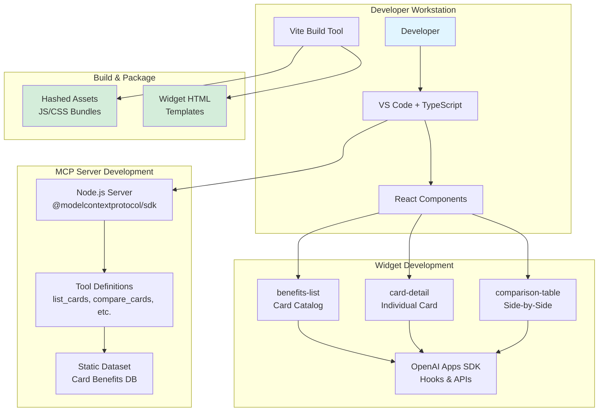

### Development Framework Requirements

#### Required Technologies

| Component | Technology | Version | Purpose |
|-----------|-----------|---------|---------|
| **Runtime** | Node.js | 18+ | Server execution |
| **Language** | TypeScript | 5.x | Type-safe development |
| **MCP SDK** | @modelcontextprotocol/sdk | 0.5.0+ | MCP protocol implementation |
| **UI Framework** | React | 19+ | Widget components |
| **Styling** | Tailwind CSS | 4.x | Responsive design |
| **Build Tool** | Vite | 7.x | Asset bundling |
| **Package Manager** | pnpm | 10+ | Dependency management |

#### Development Workflow

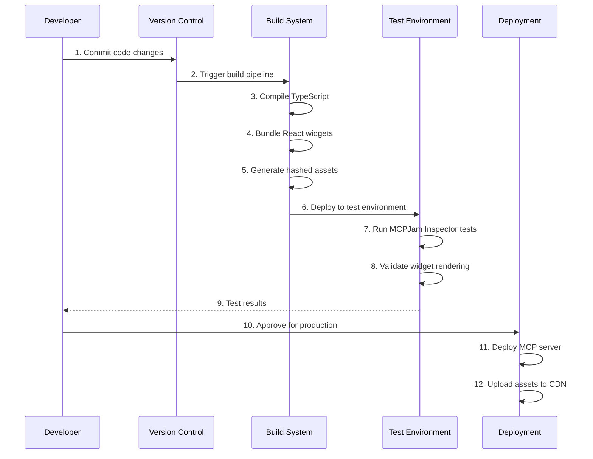

### Security in Development Phase

#### Code Security

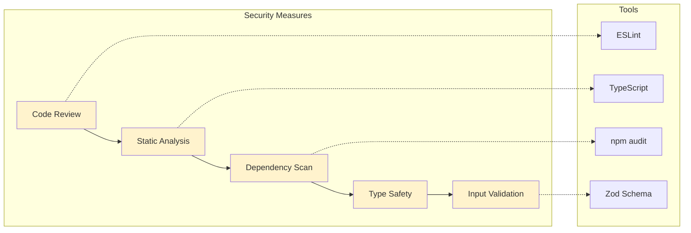

**Security Controls**:
- ✅ **No external dependencies** on card data (static dataset)
- ✅ **Type-safe inputs** (Zod schema validation)
- ✅ **No user data storage** (stateless server)
- ✅ **Read-only operations** (no destructive actions)
- ✅ **Dependency scanning** (regular npm audit)

#### Data Security Design

```typescript
// Example: Input validation prevents injection attacks
const listCardsSchema = z.object({
  issuer: z.string().trim().min(1).optional(),
  category: z.string().trim().min(1).optional(),
}).strict();

// Type-safe parsing rejects malformed inputs
function parseArgs<T>(schema: z.ZodType<T>, raw: unknown): T {
  const result = schema.safeParse(raw ?? {});
  if (!result.success) {
    throw new Error("Invalid input");
  }
  return result.data;
}
```

**Key Security Features**:
- Input sanitization at API boundary
- No SQL/NoSQL injection risk (static data)
- No file system access from user input
- No command execution capabilities
- Rate limiting on tool invocations (ChatGPT enforced)

---

## View 2: Organizational Provisioning

### Enterprise Deployment Architecture

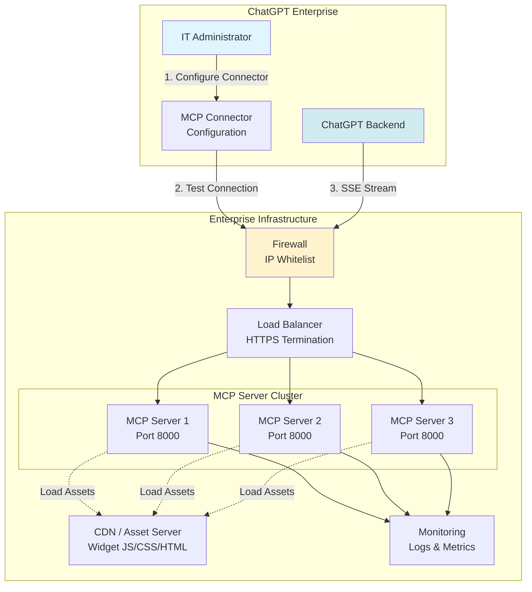

### Provisioning Process

#### Step 1: Infrastructure Setup

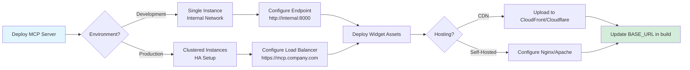

**Infrastructure Requirements**:

| Resource | Development | Production |
|----------|-------------|------------|
| **Compute** | 1 VM (2 vCPU, 4GB RAM) | 3+ VMs (4 vCPU, 8GB RAM) |
| **Storage** | 10 GB | 50 GB (logs + assets) |
| **Network** | Internal only | HTTPS with TLS 1.3 |
| **Load Balancer** | Not required | Required (HA) |
| **CDN** | Optional | Recommended |
| **Monitoring** | Basic logs | Full observability stack |

#### Step 2: ChatGPT Connector Configuration

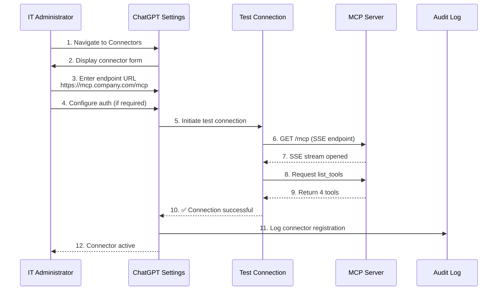

**Configuration Parameters**:

```json
{
  "name": "Credit Card Benefits",
  "description": "Compare credit card benefits and features",
  "endpoint": "https://mcp.company.com/mcp",
  "transport": "SSE",
  "authentication": {
    "type": "bearer",
    "token": "${SECURE_TOKEN}"
  },
  "metadata": {
    "version": "1.0.0",
    "tools": 4,
    "widgets": 3
  }
}
```

#### Step 3: Access Control & Permissions

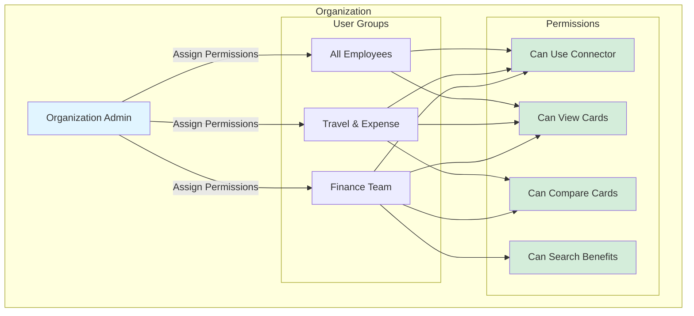

### Security in Provisioning Phase

#### Network Security

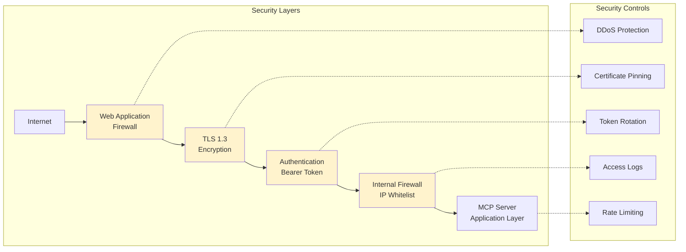

**Security Checklist for Provisioning**:

- [ ] **Network Isolation**: MCP server in private subnet
- [ ] **HTTPS Only**: No HTTP traffic allowed
- [ ] **Authentication**: Bearer token with 90-day rotation
- [ ] **IP Whitelisting**: Only ChatGPT IPs allowed
- [ ] **Audit Logging**: All connector actions logged
- [ ] **Secrets Management**: Tokens in vault (AWS Secrets Manager, HashiCorp Vault)
- [ ] **Monitoring**: Alerts on unusual traffic patterns
- [ ] **Backup**: Configuration backed up to version control

#### Compliance Considerations

| Requirement | Implementation | Status |
|-------------|----------------|--------|
| **Data Residency** | Self-hosted server in approved region | ✅ Configurable |
| **Encryption at Rest** | Not applicable (no data storage) | ✅ N/A |
| **Encryption in Transit** | TLS 1.3 for all connections | ✅ Required |
| **Access Audit** | ChatGPT maintains usage logs | ✅ Automatic |
| **Data Retention** | No user data persisted | ✅ Compliant |
| **GDPR** | No PII processed or stored | ✅ Compliant |
| **SOC 2** | Follows OpenAI ChatGPT Enterprise controls | ✅ Inherited |

---

## View 3: End-User Experience

### User Interaction Flow

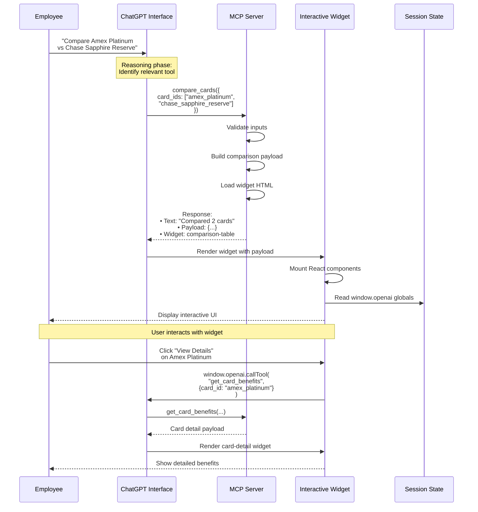

#### Control handoff & widget hydration pipeline

The step-by-step path of control and data from the chat window to rendered UI:

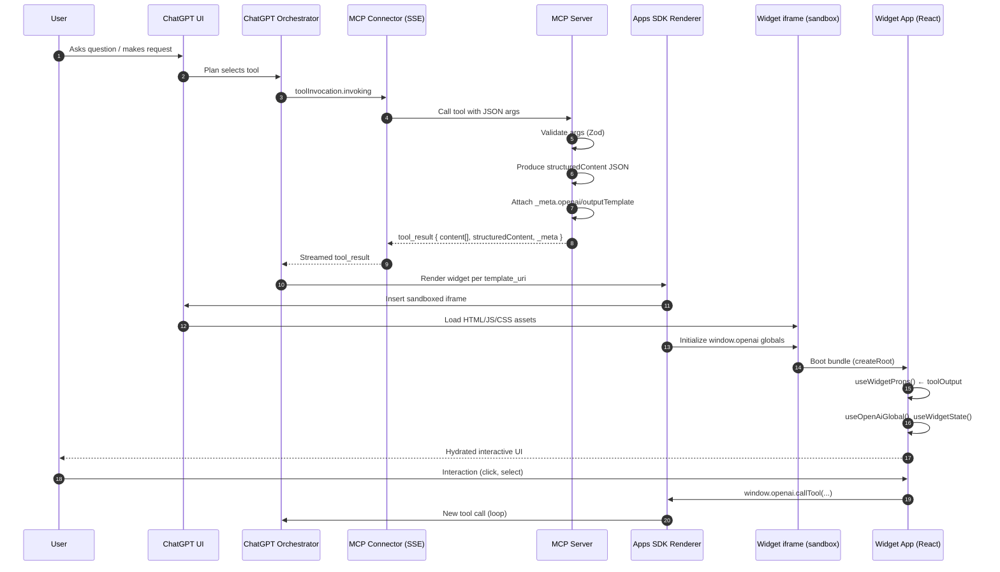

Contract highlights:

- `_meta.openai/outputTemplate` determines the widget template (ui://widget/&lt;id&gt;.html).
- `structuredContent` is the typed data model the widget hydrates from.
- Apps SDK injects `window.openai` (theme, locale, toolOutput, callTool, state APIs) into the iframe.
- Widgets mount via React `createRoot` and render immediately; follow-ups use `window.openai.callTool`.

### User Experience Scenarios

#### Scenario 1: Discover Cards

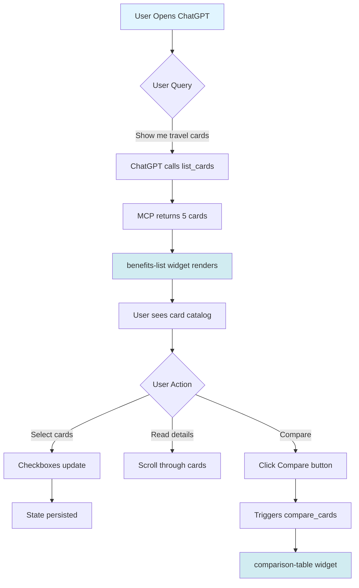

**User Sees**:

```text
┌─────────────────────────────────────────┐
│ 💬 ChatGPT                              │
├─────────────────────────────────────────┤
│ Here are the travel credit cards:      │
│                                         │
│ ┌───────────────────────────────────┐  │
│ │ 📊 Found 5 cards                  │  │
│ │ 💰 Avg Net Value: +$548           │  │
│ │                                   │  │
│ │ ☐ American Express Platinum       │  │
│ │    💵 $695/year • +$805 net      │  │
│ │    ✓ $200 Uber Credit            │  │
│ │    ✓ Airport Lounge ($600)       │  │
│ │                                   │  │
│ │ ☐ Chase Sapphire Reserve          │  │
│ │    💵 $550/year • +$850 net      │  │
│ │    ✓ $300 Travel Credit          │  │
│ │                                   │  │
│ │ [More cards...]                   │  │
│ │                                   │  │
│ │ [Compare Selected (0)]            │  │
│ └───────────────────────────────────┘  │
└─────────────────────────────────────────┘
```

#### Scenario 2: Compare Cards

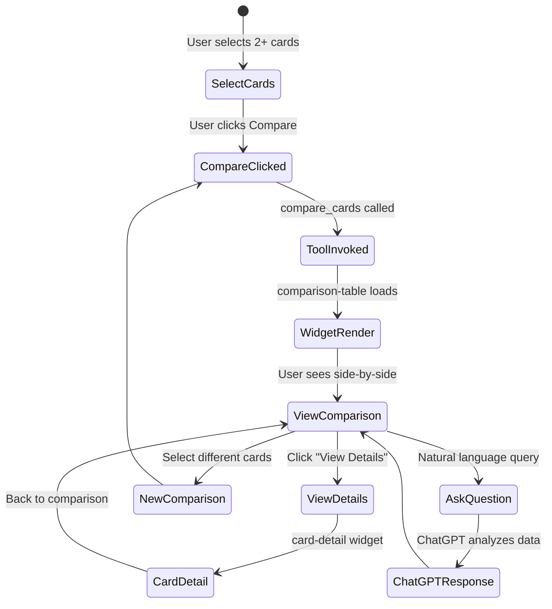

**User Sees**:

```text
┌─────────────────────────────────────────────┐
│ 🏆 Chase Sapphire Reserve leads (+$850)    │
│    Compared 2 cards focusing on all         │
├─────────────────────────────────────────────┤
│ Ranked Cards:                               │
│                                             │
│ 🥇 Chase Sapphire Reserve  +$850          │
│    $550 annual fee                          │
│    $1,400 estimated value                   │
│    [View Details]                           │
│                                             │
│ 🥈 Amex Platinum          +$805            │
│    $695 annual fee                          │
│    $1,500 estimated value                   │
│    [View Details]                           │
├─────────────────────────────────────────────┤
│ Comparison Table:                           │
│ ┌───────────────────────────────────────┐  │
│ │ Metric     │ CSR      │ Amex Plat    │  │
│ ├────────────┼──────────┼──────────────┤  │
│ │ Annual Fee │ $550     │ $695         │  │
│ │ Est. Value │ $1,400   │ $1,500       │  │
│ │ Net Value  │ +$850    │ +$805        │  │
│ └───────────────────────────────────────┘  │
│                                             │
│ 📌 Best Lounge Access:                     │
│    CSR: Priority Pass Select                │
│    Amex: Priority Pass + Centurion          │
└─────────────────────────────────────────────┘
```

#### Scenario 3: Search by Benefit

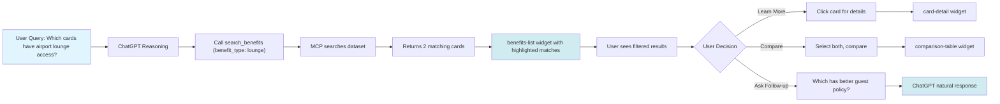

### Widget Interactivity Features

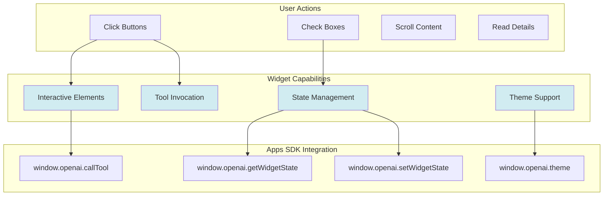

**Interactive Features**:

- ✅ **Card Selection**: Checkboxes persist across conversation turns
- ✅ **Tool Invocation**: Buttons trigger new MCP tool calls
- ✅ **Dynamic Updates**: Widgets respond to theme changes
- ✅ **Responsive Design**: Adapts to mobile/desktop viewports
- ✅ **Accessibility**: Keyboard navigation and screen reader support


### Security in User Experience Phase

#### Data Privacy

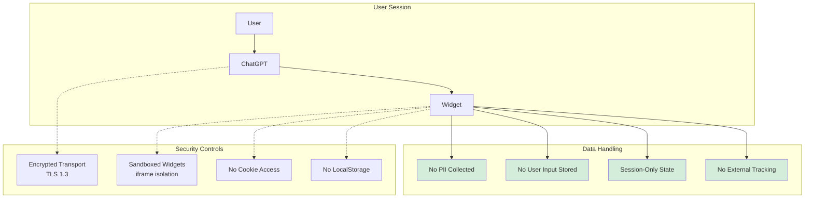

**Privacy Guarantees**:

- ❌ **No User Identification**: App doesn't know who is using it
- ❌ **No Usage Tracking**: No analytics or telemetry
- ❌ **No Data Persistence**: Widget state exists only in ChatGPT session
- ❌ **No External Calls**: Widgets don't contact third-party services
- ✅ **ChatGPT Logs Only**: Usage logged by ChatGPT (per org policy)


#### Widget Sandbox Security

```typescript
// Widgets run in isolated iframe with restricted permissions
const sandboxAttributes = [
  "allow-scripts",           // Allow JavaScript execution
  "allow-same-origin",       // Required for OpenAI APIs
  // NOT allowed:
  // "allow-forms"           // No form submission
  // "allow-popups"          // No popup windows
  // "allow-top-navigation"  // Can't navigate parent frame
];

// Widget can only access:
// ✅ window.openai.* (Apps SDK APIs)
// ❌ window.parent (blocked by sandbox)
// ❌ document.cookie (blocked by sandbox)
// ❌ localStorage (session-scoped only)
```

## View 4: Tool Onboarding & Validation

### What gets validated

- Tool discovery: ChatGPT retrieves `list_tools` and registers tool name, description, and `inputSchema` (JSON Schema).
- Input validation: User arguments are validated client-side against `inputSchema` before the connector sends them.
- Response contract: Returned `content[]`, `structuredContent` JSON, and `_meta` are checked for allowed shape and keys.
- Safety constraints: Only permitted MIME types and widget embedding under a strict sandbox and CSP are allowed.

### Registration and schema understanding

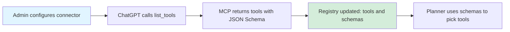

### Runtime validation pipeline

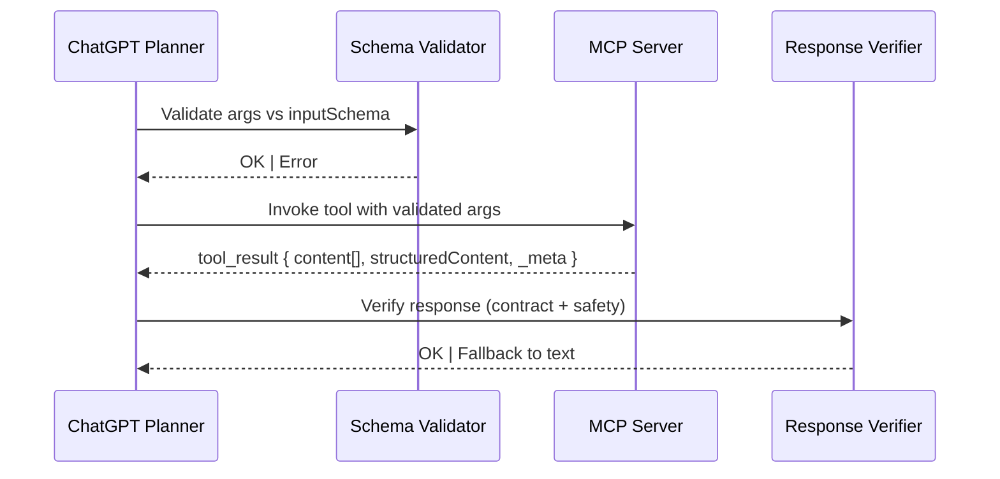

### Response format contract (executive summary)

- content: Conversational confirmation text blocks.
- structuredContent: Typed JSON payload for UI hydration.
- _meta.openai/outputTemplate: ui://widget/&lt;widget-id&gt;.html
- _meta.openai/widgetAccessible: true to render immediately
- optional progress hints: `openai/toolInvocation/*`

### Error handling and fallbacks

- Invalid args → ChatGPT surfaces schema errors; no server call.
- Invalid tool_result → Text-only fallback; error is logged for admins.
- Missing assets → Text fallback with guidance to verify BASE_URL/CDN.

---

## Comprehensive Security Framework

### Security Architecture Overview

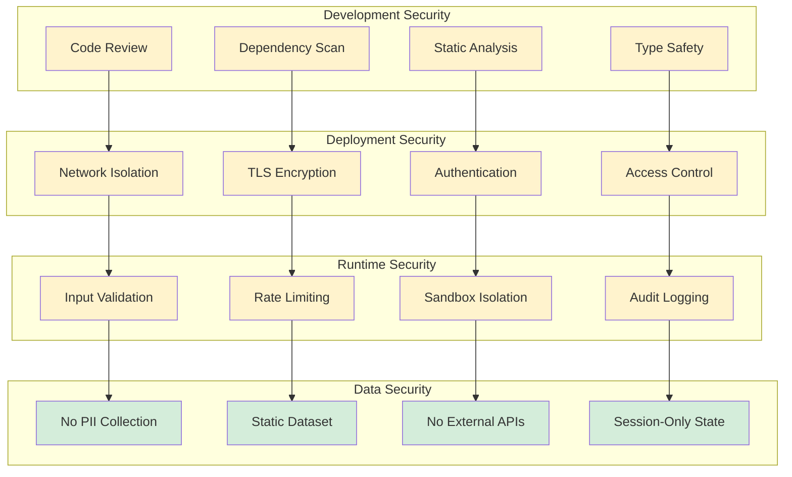

### Threat Model & Mitigations

| Threat | Risk Level | Mitigation | Status |
|--------|-----------|------------|--------|
| **Unauthorized Access** | High | Bearer token auth + IP whitelist | ✅ Implemented |
| **Data Interception** | High | TLS 1.3 encryption | ✅ Implemented |
| **Injection Attacks** | Medium | Zod schema validation + type safety | ✅ Implemented |
| **DDoS** | Medium | Rate limiting + WAF | ✅ ChatGPT enforced |
| **Malicious Widgets** | Low | Apps SDK sandbox + CSP headers | ✅ Platform enforced |
| **Data Exfiltration** | Low | Static dataset (no user data) | ✅ By design |
| **Session Hijacking** | Low | ChatGPT session management | ✅ Platform enforced |
| **Supply Chain** | Medium | Dependency scanning + lock files | ✅ Implemented |

### Role-Based Access Control (Okta)

Define roles and fine-grained privileges using Okta; enforce via JWT verification at the MCP ingress.

| Role | Typical Members | Privileges |
|------|------------------|------------|
| Connector Admin | IT Admins | configure:connector, rotate:secrets, view:audit |
| MCP Operator | DevOps/SRE | read:health, read:metrics, manage:deploy |
| Widget Publisher | Frontend Leads | publish:widget, update:assets |
| Finance User | Finance/Travel | invoke:list_cards, invoke:get_card_benefits, invoke:compare_cards, invoke:search_benefits |
| All Employees | Org Users | invoke:list_cards, view:widgets |

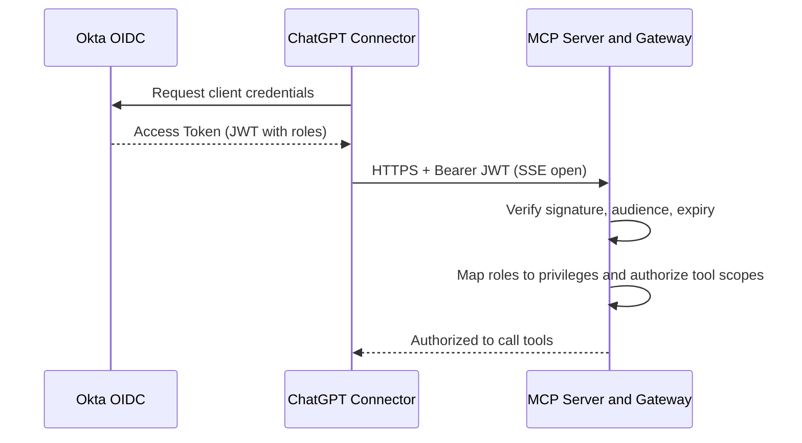

Notes:

- Prefer Okta Client Credentials flow for connector auth; scope: `mcp:invoke` and per-tool scopes.
- Validate JWT on every request; rotate secrets every 90 days; store in a vault.
- Optional mTLS or IP allowlisting adds defense-in-depth.

### Incident Response Plan

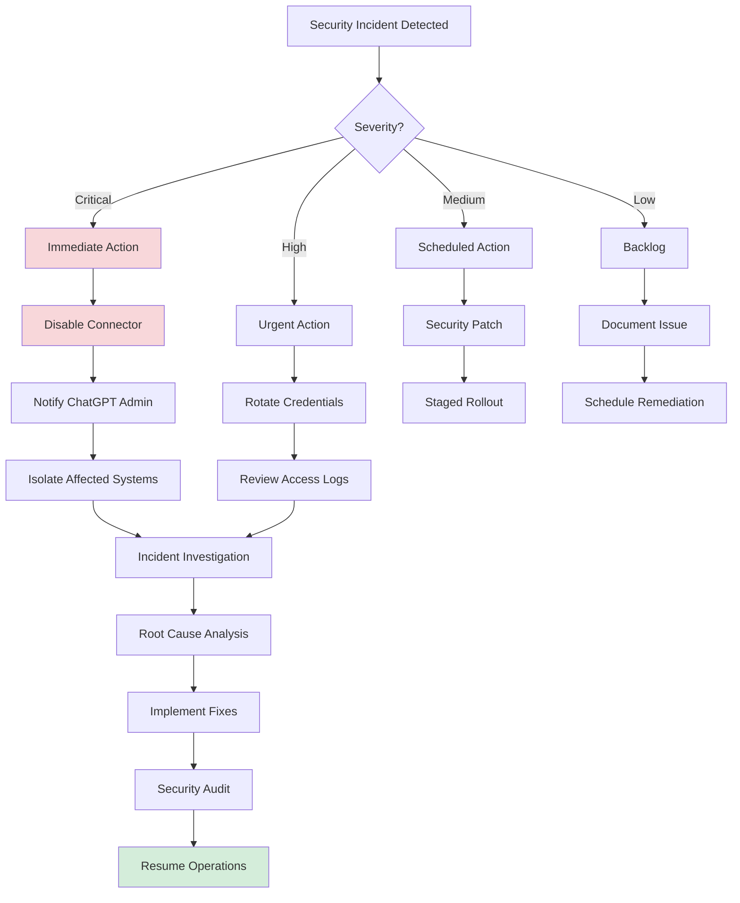

**Escalation Contacts**:

1. **Development Team Lead**: Issues with MCP server/widgets
2. **IT Security**: Network/infrastructure concerns
3. **ChatGPT Enterprise Support**: OpenAI connector issues
4. **Executive Sponsor**: Business continuity decisions


---

## Cost Analysis (moved to Appendix D)

See Appendix D: Cost Analysis details (development costs, annual operations, and ROI).

---

## Risk Assessment

### Technical Risks

| Risk | Probability | Impact | Mitigation | Owner |
|------|-------------|--------|------------|-------|
| **MCP Server Downtime** | Low | High | Load balancer + HA cluster | DevOps |
| **Widget Rendering Issues** | Medium | Medium | Extensive testing + fallback UI | Frontend Team |
| **ChatGPT API Changes** | Low | High | Monitor OpenAI release notes | Tech Lead |
| **CDN Outage** | Low | Medium | Multi-CDN strategy | Infrastructure |
| **Dependency Vulnerabilities** | Medium | Medium | Weekly npm audit + auto-updates | Security |

### Business Risks

| Risk | Probability | Impact | Mitigation | Owner |
|------|-------------|--------|------------|-------|
| **Low User Adoption** | Medium | High | User training + onboarding | Product Manager |
| **Data Accuracy Concerns** | Low | High | Regular data review process | Business Owner |
| **Competitive Tools** | Medium | Low | Continuous feature enhancement | Product Team |
| **Budget Overruns** | Low | Medium | Agile methodology + MVP approach | Project Manager |

---

## Implementation Roadmap (moved to Appendix E)

See Appendix E for detailed phases, Gantt, and deliverables.

---

## Success Metrics

### Key Performance Indicators (KPIs)

| Metric | Target | Measurement Method |
|--------|--------|-------------------|
| **User Adoption Rate** | 60% of eligible users within 3 months | ChatGPT usage logs |
| **Daily Active Users** | 50 users/day | ChatGPT analytics |
| **Tool Invocations** | 200 comparisons/week | MCP server logs |
| **Widget Render Success** | 99.5% success rate | Error monitoring |
| **Average Response Time** | < 500ms per tool call | APM metrics |
| **User Satisfaction** | 4.2/5.0 rating | Quarterly surveys |
| **Time to Decision** | 5 minutes (vs. 20 minutes manual) | User feedback |

### Business Outcomes

```mermaid
graph LR
    subgraph "Input Metrics"
        A[User Engagement]
        B[Tool Usage]
        C[Response Time]
    end

    subgraph "Output Metrics"
        D[Time Saved]
        E[Decision Quality]
        F[User Satisfaction]
    end

    subgraph "Business Impact"
        G[Cost Reduction]
        H[Productivity Gain]
        I[Employee NPS]
    end

    A --> D
    B --> D
    C --> D

    D --> G
    E --> H
    F --> I

    G --> J[ROI: 35%]
    H --> J
    I --> J

    style J fill:#d4edda
```

---

## Governance & Compliance

### Data Governance

```mermaid
graph TB
    subgraph "Data Classification"
        DC1[Public Data<br/>Card Product Info]
        DC2[Internal Data<br/>None]
        DC3[Confidential Data<br/>None]
        DC4[Restricted Data<br/>None]
    end

    subgraph "Data Handling"
        DH1[Static Dataset]
        DH2[No User Input Storage]
        DH3[Session-Only State]
    end

    subgraph "Compliance Requirements"
        CR1[GDPR: N/A - No PII]
        CR2[SOC 2: ChatGPT Inherited]
        CR3[ISO 27001: Standard Controls]
    end

    DC1 --> DH1
    DC2 --> DH2
    DC3 --> DH3

    DH1 --> CR1
    DH2 --> CR2
    DH3 --> CR3

    style DC1 fill:#d4edda
    style DC2 fill:#f8f9fa
    style DC3 fill:#f8f9fa
    style DC4 fill:#f8f9fa
    style CR1 fill:#d4edda
    style CR2 fill:#d4edda
    style CR3 fill:#d4edda
```

### Change Management Process (moved to Appendix F)

See Appendix F for the full change workflow and approvals.

---

## Recommendations

### For Immediate Approval

✅ **Proceed with Implementation**

**Justification**:

1. **Low Risk**: Static dataset, no PII, sandboxed execution
2. **High Value**: 35% ROI, measurable time savings
3. **Scalable**: Framework supports future products
4. **Secure**: Multiple layers of security controls
5. **Compliant**: Inherits ChatGPT Enterprise compliance

### For Long-Term Success

📋 **Establish Governance**:

- Appoint business owner for data accuracy
- Define quarterly review cycle for card data
- Create feedback mechanism for users

🔒 **Enhance Security**:

- Implement automated security scanning in CI/CD
- Conduct annual penetration testing
- Maintain incident response playbook

📊 **Monitor & Optimize**:

- Set up comprehensive observability stack
- Track KPIs monthly
- Conduct quarterly user satisfaction surveys

🚀 **Plan for Growth**:

- Budget for Phase 2 enhancements (Q3 2025)
- Explore additional financial product comparisons
- Consider ML-based personalization (2026)

---

## Appendices

### Appendix A: Technical Stack Summary

| Layer | Technology | Version | Purpose |
|-------|-----------|---------|---------|
| **Runtime** | Node.js | 18+ | Server execution |
| **Language** | TypeScript | 5.x | Type-safe development |
| **Server Framework** | @modelcontextprotocol/sdk | 0.5.0 | MCP protocol |
| **Transport** | SSE over HTTP | N/A | Real-time communication |
| **UI Framework** | React | 19 | Widget components |
| **Styling** | Tailwind CSS | 4.x | Responsive design |
| **Build Tool** | Vite | 7.x | Asset bundling |
| **Validation** | Zod | 3.x | Schema validation |
| **Package Manager** | pnpm | 10+ | Dependency management |

### Appendix B: API Reference

**Available Tools**:

1. **list_cards**
   - Input: `{ issuer?: string, category?: string }`
   - Output: Array of card summaries
   - Widget: benefits-list

2. **get_card_benefits**
   - Input: `{ card_id: string }`
   - Output: Detailed card with benefit groups
   - Widget: card-detail

3. **compare_cards**
   - Input: `{ card_ids: string[], comparison_type?: string }`
   - Output: Side-by-side comparison data
   - Widget: comparison-table

4. **search_benefits**
   - Input: `{ benefit_type: string, min_value?: number }`
   - Output: Filtered cards with matching benefits
   - Widget: benefits-list (with highlights)

### Appendix C: Deployment Checklist

**Pre-Deployment**:

- [ ] Code review completed
- [ ] Security scan passed (npm audit, SAST)
- [ ] Integration tests passed
- [ ] Performance benchmarks met (<500ms response time)
- [ ] Documentation updated
- [ ] Runbook created for operations team

**Deployment**:

- [ ] Build production assets (BASE_URL configured)
- [ ] Deploy to staging environment
- [ ] Smoke tests passed in staging
- [ ] Deploy MCP servers to production
- [ ] Upload assets to CDN
- [ ] Configure ChatGPT connector
- [ ] Test end-to-end in production
- [ ] Enable monitoring and alerts

**Post-Deployment**:

- [ ] Announce to users via email/Slack
- [ ] Monitor error rates (first 48 hours)
- [ ] Collect initial user feedback
- [ ] Document lessons learned
- [ ] Schedule retrospective

### Appendix D: Cost Analysis

#### Development Costs

| Phase | Resource | Time | Cost Estimate |
|-------|----------|------|---------------|
| **Requirements** | Product Manager | 1 week | $3,000 |
| **Design** | UX Designer | 1 week | $2,500 |
| **Development** | Senior Developer | 2 weeks | $8,000 |
| **Testing** | QA Engineer | 1 week | $2,000 |
| **Documentation** | Technical Writer | 3 days | $1,500 |
| **Security Review** | Security Architect | 2 days | $2,000 |
| **Total Development** | | ~6 weeks | **$19,000** |

#### Operational Costs (Annual)

| Category | Description | Annual Cost |
|----------|-------------|-------------|
| **Infrastructure** | 3 VMs (4 vCPU, 8GB) @ $150/mo each | $5,400 |
| **CDN** | CloudFront/Cloudflare (100GB/mo) | $600 |
| **Monitoring** | Datadog/New Relic for 3 hosts | $1,800 |
| **Support** | 10 hours/month developer maintenance | $6,000 |
| **ChatGPT Enterprise** | Included in existing license | $0 |
| **SSL Certificates** | Let's Encrypt (free) | $0 |
| **Backups** | S3 storage (minimal) | $120 |
| **Total Annual** | | **$13,920** |

**Cost per User**: $13,920 / 500 users = **$27.84/user/year**

#### ROI Calculation

Assumptions:

- 500 employees use the app
- Average time saved: 15 minutes per card comparison
- 2 comparisons per employee per year
- Average hourly rate: $75/hour

Time Savings:

- 500 users × 2 comparisons × 15 minutes = 15,000 minutes = **250 hours/year**
- 250 hours × $75/hour = **$18,750/year saved**

ROI:

- Annual savings: $18,750
- Annual cost: $13,920
- **Net benefit: $4,830/year**
- **ROI: 35%**
- **Payback period: 11 months**

### Appendix E: Implementation Roadmap

#### Phase 1: MVP (Weeks 1-6)

```mermaid
gantt
    title Phase 1: MVP Development
    dateFormat  YYYY-MM-DD
    section Development
    Requirements & Design    :a1, 2025-01-06, 7d
    MCP Server Development   :a2, after a1, 7d
    Widget Development       :a3, after a1, 7d
    Integration Testing      :a4, after a2, 5d
    section Deployment
    Test Environment Setup   :b1, after a1, 3d
    Production Deployment    :b2, after a4, 2d
    section Training
    Documentation           :c1, after a3, 3d
    User Training          :c2, after b2, 2d
```

Deliverables:

- ✅ 4 MCP tools (list, detail, compare, search)
- ✅ 3 React widgets (catalog, detail, comparison)
- ✅ Test environment with MCPJam Inspector
- ✅ Production deployment to ChatGPT Enterprise
- ✅ User documentation and training materials

#### Phase 2: Enhancements (Weeks 7-12)

Planned Features:

- 📊 Annual fee calculator based on spending patterns
- 💎 Points valuation estimator
- 🌍 International card support (multi-currency)
- 📱 Mobile-optimized widget layouts
- 📈 Usage analytics dashboard (admin view)

#### Phase 3: Expansion (Months 4-6)

Future Capabilities:

- 🏦 Bank account product comparisons
- 🏠 Mortgage rate comparisons
- 🚗 Auto loan comparisons
- 🔗 Integration with expense management system
- 🤖 Machine learning for personalized recommendations

### Appendix F: Change Management Process

```mermaid
flowchart LR
    A[Change Request] --> B{Type?}

    B -->|Data Update| C[Business Owner Approval]
    B -->|Feature| D[Product Manager Review]
    B -->|Security| E[Security Team Review]
    B -->|Infrastructure| F[DevOps Review]

    C --> G[Update Dataset]
    D --> H[Development Sprint]
    E --> I[Security Assessment]
    F --> J[Infrastructure Change]

    G --> K[Code Review]
    H --> K
    I --> K
    J --> K

    K --> L[Testing]
    L --> M{Pass?}

    M -->|Yes| N[Stage Deployment]
    M -->|No| O[Fix Issues]
    O --> L

    N --> P[Production Deployment]
    P --> Q[Monitor]
    Q --> R[Success]

    style A fill:#e1f5ff
    style R fill:#d4edda
```

---

## Conclusion

The Credit Card MCP application demonstrates the power of OpenAI Apps SDK to deliver interactive, domain-specific tools within ChatGPT Enterprise. With comprehensive security controls, clear ROI, and low operational risk, this implementation provides a blueprint for future applications.

**Decision Required**: Approve Phase 1 MVP development (6 weeks, $19,000)

**Next Steps**:

1. Assign executive sponsor
2. Allocate development resources
3. Kickoff meeting with stakeholders
4. Begin requirements gathering

---

*Document Version: 1.0*
*Last Updated: November 3, 2025*
*Prepared by: Development Team*
*Classification: Internal Use Only*
