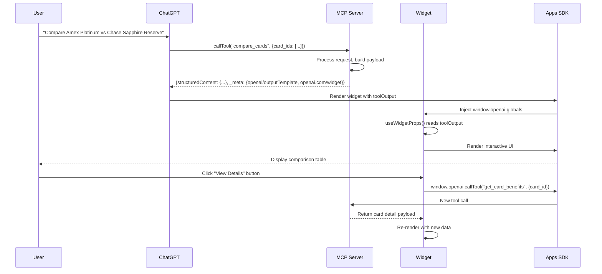
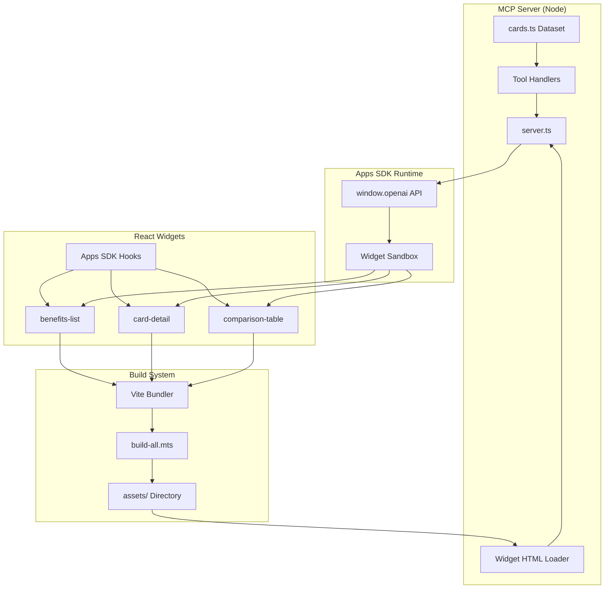
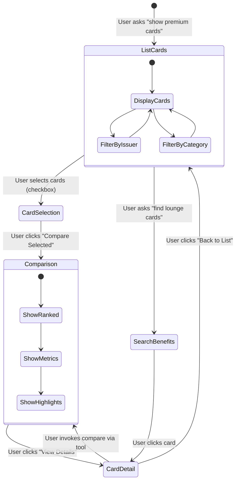
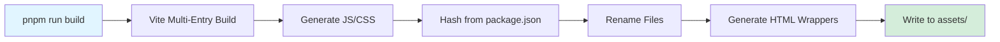
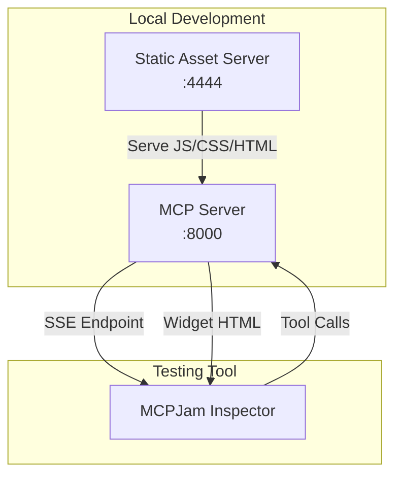
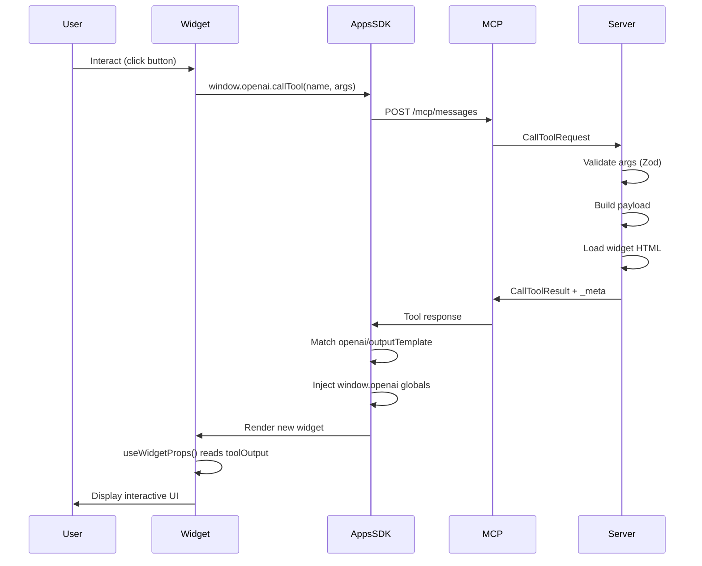
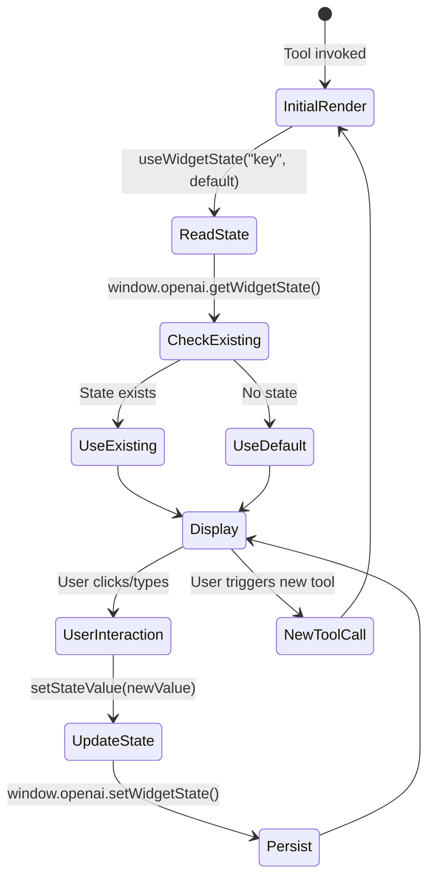
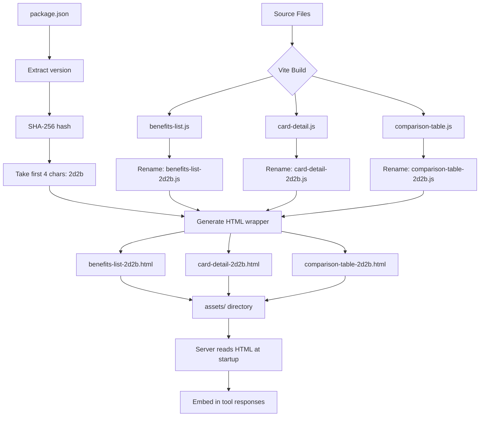
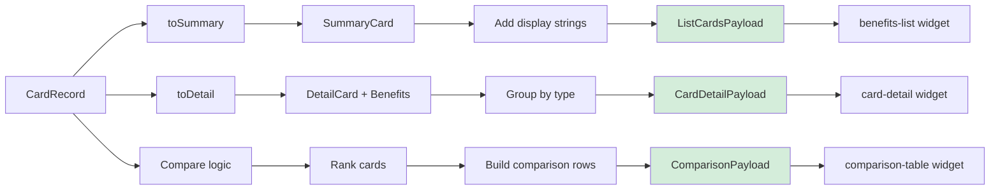

# Credit Card MCP Server: Hands-On Guide

**Complete walkthrough of designing, developing, building, and testing an OpenAI Apps SDK MCP server with interactive widgets**

---

## Table of Contents

1. [Overview](#overview)
2. [Architecture](#architecture)
3. [Design Process](#design-process)
4. [Development Process](#development-process)
5. [Build Process](#build-process)
6. [Testing Process](#testing-process)
7. [Visual Flows](#visual-flows)
8. [Troubleshooting](#troubleshooting)
9. [Lessons Learned](#lessons-learned)

---

## Overview

### What We Built

A Model Context Protocol (MCP) server that provides credit card information through four interactive tools:

- **`list_cards`**: Browse available credit cards with filtering
- **`get_card_benefits`**: View detailed benefit breakdown for a specific card
- **`compare_cards`**: Side-by-side comparison of multiple cards
- **`search_benefits`**: Find cards by benefit type (e.g., "lounge access")

Each tool returns structured data that renders as an **interactive React widget** using the OpenAI Apps SDK.

### Technology Stack

- **Server**: Node.js with `@modelcontextprotocol/sdk` (SSE transport)
- **Widgets**: React 19 + Tailwind CSS 4.x
- **Build**: Vite 7.x with custom multi-entry bundler
- **Data**: Static TypeScript dataset (5 premium credit cards)
- **Testing**: MCPJam Inspector (beta)

### Project Structure

```
credit-cards_server_node/
├── src/
│   ├── server.ts              # MCP server with SSE transport
│   └── data/
│       ├── cards.ts           # Card dataset and utilities
│       └── types.ts           # TypeScript type definitions
├── package.json
└── README.md

src/
├── credit-cards/
│   └── types.ts               # Shared payload types for widgets
├── benefits-list/
│   └── index.tsx              # Card catalog widget
├── card-detail/
│   └── index.tsx              # Individual card detail widget
└── comparison-table/
    └── index.tsx              # Comparison widget

assets/                        # Build output (gitignored)
├── benefits-list-2d2b.html
├── benefits-list-2d2b.js
├── benefits-list-2d2b.css
├── card-detail-2d2b.html
├── card-detail-2d2b.js
├── card-detail-2d2b.css
├── comparison-table-2d2b.html
├── comparison-table-2d2b.js
└── comparison-table-2d2b.css
```

---

## Architecture

### High-Level Data Flow



### Component Architecture



---

## Design Process

### Step 1: Define User Stories

**Primary Use Cases:**

1. **Discovery**: "Show me premium travel credit cards"
2. **Detail**: "What benefits does the Amex Platinum offer?"
3. **Comparison**: "Compare Amex Platinum vs Chase Sapphire Reserve"
4. **Search**: "Which cards have airport lounge access?"

### Step 2: Design Data Model

**Card Record Structure:**

```typescript
interface CardRecord {
  id: string;                    // "amex_platinum"
  name: string;                  // "American Express Platinum Card"
  shortName: string;             // "Amex Platinum"
  issuer: string;                // "amex"
  category: string;              // "premium-travel"
  annualFee: number;             // 695
  welcomeOffer: WelcomeOffer;
  benefits: Benefit[];
  earningRates: EarningRate[];
  apr: APRInfo;
  creditRequirement: string;
  bestFor: string[];
}
```

**Key Design Decisions:**

- **Static dataset**: 5 premium cards (no external API dependency)
- **Benefit categorization**: `statement_credit`, `perk`, `protection`
- **Value estimation**: Annual dollar value for each benefit
- **Display-ready fields**: Pre-formatted strings for UI rendering

### Step 3: Define Tools and Widgets

| Tool | Purpose | Widget | Key Features |
|------|---------|--------|--------------|
| `list_cards` | Browse/filter cards | `benefits-list` | Card selection, comparison toggle |
| `search_benefits` | Find by benefit | `benefits-list` | Highlight matching benefits |
| `get_card_benefits` | Detail view | `card-detail` | Benefit groups, pros/cons |
| `compare_cards` | Side-by-side | `comparison-table` | Ranked cards, metric table |

**Widget Reuse Pattern:**
- `list_cards` and `search_benefits` share the `benefits-list` widget
- Differentiated by `payload.resultType` and `filters.benefitType`

### Step 4: Design Interaction Flow



---

## Development Process

### Phase 1: Server Foundation

**File: `credit-cards_server_node/src/server.ts`**

#### Step 1.1: Setup MCP Server

```typescript
import { Server } from "@modelcontextprotocol/sdk/server/index.js";
import { SSEServerTransport } from "@modelcontextprotocol/sdk/server/sse.js";

function createCreditCardsServer(): Server {
  const server = new Server(
    {
      name: "credit-cards",
      version: "0.1.0",
    },
    {
      capabilities: {
        resources: {},
        tools: {},
      },
    }
  );

  // Register handlers...

  return server;
}
```

#### Step 1.2: Define Widget Catalog

```typescript
const widgetCatalog = (() => {
  const definitions: WidgetDefinition[] = [
    {
      id: "benefits-list",
      title: "Credit card list",
      templateUri: "ui://widget/benefits-list.html",
      invoking: "Gathering matching cards",
      invoked: "Showing matching cards",
      html: readWidgetHtml("benefits-list"),
      responseText: "Generated a list of matching credit cards.",
    },
    // ... more widgets
  ];

  const byId = new Map(definitions.map((widget) => [widget.id, widget]));
  const byUri = new Map(definitions.map((widget) => [widget.templateUri, widget]));

  return { list: definitions, byId, byUri, get(id: string) { ... } };
})();
```

**Key Pattern**: Widget definitions include both URI and HTML content for flexible delivery.

#### Step 1.3: Implement Tool Handlers

```typescript
function handleListCards(rawArgs: unknown): CallToolResult {
  const args = parseArgs(listCardsSchema, rawArgs);
  const payload = listCardsPayload(args, "list_cards");

  return makeCallResult(
    widgetCatalog.get("benefits-list"),
    payload,
    payload.headline
  );
}
```

**Critical Components:**
- **Input validation**: Zod schema parsing with error messages
- **Payload builders**: Transform data model to widget-ready format
- **Metadata injection**: `widgetMeta()` adds all required Apps SDK fields

#### Step 1.4: Add Widget Metadata

```typescript
function widgetMeta(widget: WidgetDefinition, overrides?: Record<string, unknown>) {
  return {
    "openai/outputTemplate": widget.templateUri,
    "openai/toolInvocation/invoking": widget.invoking,
    "openai/toolInvocation/invoked": widget.invoked,
    "openai/widgetAccessible": true,
    "openai/resultCanProduceWidget": true,
    "openai.com/widget": {
      uri: widget.templateUri,
      mimeType: "text/html+skybridge",
      text: widget.html,
    },
    ...overrides,
  };
}
```

**Why Each Field Matters:**
- `openai/outputTemplate`: URI for Apps SDK to match widget
- `openai.com/widget`: Embedded HTML for MCPJam Inspector
- `openai/widgetAccessible`: Tells ChatGPT widget can be rendered
- `openai/toolInvocation/*`: UI status messages during tool execution

### Phase 2: Data Layer

**File: `credit-cards_server_node/src/data/cards.ts`**

#### Step 2.1: Create Card Dataset

```typescript
const CARDS: CardRecord[] = [
  {
    id: "amex_platinum",
    name: "American Express Platinum Card",
    shortName: "Amex Platinum",
    issuer: "amex",
    category: "premium-travel",
    annualFee: 695,
    welcomeOffer: {
      points: 80000,
      spend: 8000,
      months: 6,
      estimatedValue: 1600,
    },
    benefits: [
      credit("uber", "Uber Cash", 200, "Monthly Uber credits", "recurring"),
      perk("lounge", "Airport Lounge Access", 600, "Priority Pass Select + Centurion"),
      // ... more benefits
    ],
    // ... more fields
  },
  // ... 4 more cards
];
```

#### Step 2.2: Build Helper Functions

```typescript
export function toSummary(card: CardRecord) {
  return {
    id: card.id,
    name: card.name,
    shortName: card.shortName,
    issuer: card.issuer,
    category: card.category,
    annualFee: card.annualFee,
    totalBenefitValue: cardTotalBenefitValue(card),
    netValue: cardNetValue(card),
    welcomeOffer: card.welcomeOffer,
    topBenefits: topBenefits(card, 3),
  };
}

export function toDetail(card: CardRecord) {
  const benefitGroups = [
    {
      id: "statement_credits",
      title: "Statement Credits & Reimbursements",
      benefits: card.benefits.filter((b) => b.type === "statement_credit"),
    },
    // ... more groups
  ];

  return {
    card,
    benefits: card.benefits,
    benefitGroups,
    totalBenefitValue: cardTotalBenefitValue(card),
    netValue: cardNetValue(card),
    bestFor: card.bestFor,
  };
}
```

**Design Pattern**: Separate summary (list view) from detail (full view) to optimize payload size.

### Phase 3: Widget Development

**Shared Types: `src/credit-cards/types.ts`**

```typescript
export type ListCardsPayload = {
  resultType: "list_cards" | "search_benefits";
  headline: string;
  filters: {
    issuer: string | null;
    category: string | null;
    benefitType: string | null;
    minValue: number | null;
  };
  stats: {
    totalCards: number;
    averageNetValue: number;
    averageNetValueDisplay: string;
    // ...
  };
  cards: Array<SummaryCard & {
    matchedBenefits?: BenefitSnippet[];
  }>;
  benefitMatches?: Array<{
    benefitType: string;
    items: Array<{
      cardId: string;
      cardName: string;
      benefitId: string;
      // ...
    }>;
  }>;
};
```

**Why Shared Types?** Ensures type safety between server payload builders and widget props consumption.

#### Widget 1: Benefits List (`src/benefits-list/index.tsx`)

**Core Features:**
- Card catalog with selection checkboxes
- Comparison button (appears when 2+ cards selected)
- Benefit match highlighting (for search results)
- Tool invocation for comparison

**Key Code:**

```tsx
export default function App() {
  const { payload, ready, error } = useWidgetProps<ListCardsPayload>();
  const [selectedCards, setSelectedCards] = useWidgetState<string[]>("selectedCards", []);
  const theme = useOpenAiGlobal("theme");

  const handleCompare = () => {
    if (selectedCards.length >= 2) {
      window.openai.callTool("compare_cards", {
        card_ids: selectedCards,
        comparison_type: "all",
      });
    }
  };

  if (!ready || !payload) {
    return <div>Loading...</div>;
  }

  return (
    <div className={theme === "dark" ? "dark" : ""}>
      <div className="bg-white dark:bg-gray-900 min-h-screen">
        <header className="border-b">
          <h1>{payload.headline}</h1>
          <Stats stats={payload.stats} />
        </header>

        <div className="grid gap-4">
          {payload.cards.map((card) => (
            <CardSummary
              key={card.id}
              card={card}
              isSelected={selectedCards.includes(card.id)}
              onToggleSelect={(id) => {
                setSelectedCards((prev) =>
                  prev.includes(id)
                    ? prev.filter((x) => x !== id)
                    : [...prev, id]
                );
              }}
              matchedBenefits={card.matchedBenefits}
            />
          ))}
        </div>

        {selectedCards.length >= 2 && (
          <footer className="sticky bottom-0 border-t bg-white dark:bg-gray-800">
            <button onClick={handleCompare}>
              Compare {selectedCards.length} Cards
            </button>
          </footer>
        )}
      </div>
    </div>
  );
}

// Critical: Mount React to DOM
createRoot(document.getElementById("benefits-list-root")!).render(<App />);
```

**Apps SDK Hooks Used:**
- `useWidgetProps<T>()`: Read `window.openai.toolOutput` (structured payload)
- `useWidgetState<T>()`: Persist selection across conversation turns
- `useOpenAiGlobal()`: Reactive theme changes

#### Widget 2: Card Detail (`src/card-detail/index.tsx`)

**Core Features:**
- Gradient header with card branding
- Benefit groups (Credits, Perks, Protections)
- Pros/cons lists derived from `bestFor`
- Earning rates and APR terms

**Key Code:**

```tsx
export default function App() {
  const { payload, ready } = useWidgetProps<CardDetailPayload>();

  if (!ready || !payload) return <div>Loading...</div>;

  const { card, benefitGroups, totalBenefitValue, netValue } = payload;

  return (
    <div className="max-w-4xl mx-auto">
      <div className="bg-gradient-to-r from-blue-600 to-purple-600 text-white p-8">
        <h1 className="text-3xl font-bold">{card.name}</h1>
        <div className="grid grid-cols-2 gap-4 mt-4">
          <Stat label="Annual Fee" value={formatCurrency(card.annualFee)} />
          <Stat label="Net Value" value={formatCurrency(netValue)} />
        </div>
      </div>

      {benefitGroups.map((group) => (
        <section key={group.id} className="p-6 border-b">
          <h2 className="text-xl font-semibold mb-4">{group.title}</h2>
          <div className="space-y-3">
            {group.benefits.map((benefit) => (
              <BenefitItem key={benefit.id} benefit={benefit} />
            ))}
          </div>
        </section>
      ))}

      <section className="p-6">
        <h2>Best For</h2>
        <ul className="list-disc pl-5">
          {card.bestFor.map((item, i) => (
            <li key={i}>{item}</li>
          ))}
        </ul>
      </section>
    </div>
  );
}

createRoot(document.getElementById("card-detail-root")!).render(<App />);
```

#### Widget 3: Comparison Table (`src/comparison-table/index.tsx`)

**Core Features:**
- Ranked cards with winner badge
- Comparison metrics table
- Highlight categories (best lounge, best credits, etc.)
- "View Details" action for each card

**Key Code:**

```tsx
export default function App() {
  const { payload, ready } = useWidgetProps<ComparisonPayload>();

  const handleViewDetails = (cardId: string) => {
    window.openai.callTool("get_card_benefits", { card_id: cardId });
  };

  if (!ready || !payload) return <div>Loading...</div>;

  return (
    <div>
      <header className="bg-gradient-to-r from-green-600 to-teal-600 text-white p-6">
        <h1 className="text-2xl font-bold">{payload.summary.headline}</h1>
        <p className="mt-2">{payload.summary.detail}</p>
      </header>

      <div className="grid md:grid-cols-3 gap-4 p-6">
        {payload.cards.map((card) => (
          <ComparisonCard
            key={card.id}
            card={card}
            onViewDetails={handleViewDetails}
          />
        ))}
      </div>

      <ComparisonTable rows={payload.rows} />

      <section className="p-6">
        <h2>Highlights</h2>
        {payload.highlightCategories.map((category) => (
          <div key={category.title} className="border rounded-lg p-4 mt-4">
            <h3 className="font-semibold">{category.title}</h3>
            <p className="text-sm text-gray-600">{category.description}</p>
            <ul className="mt-2">
              {category.winners.map((winner) => (
                <li key={winner.cardId}>{winner.statement}</li>
              ))}
            </ul>
          </div>
        ))}
      </section>
    </div>
  );
}

createRoot(document.getElementById("comparison-table-root")!).render(<App />);
```

**Tool Invocation Pattern:**
```typescript
window.openai.callTool(toolName, args) → Triggers new MCP tool call
```

### Phase 4: Build System Integration

**File: `build-all.mts`**

#### Step 4.1: Add Widget Targets

```typescript
const targets = [
  "pizzaz",
  "pizzaz-carousel",
  "pizzaz-list",
  "pizzaz-albums",
  "solar-system",
  "todo",
  "benefits-list",      // ← Added
  "card-detail",        // ← Added
  "comparison-table",   // ← Added
];
```

#### Step 4.2: Build Process

```bash
pnpm run build
```

**What Happens:**

1. **Multi-entry Vite build**: Each widget folder becomes a build entry
2. **JS/CSS generation**: Produces `benefits-list.js` and `benefits-list.css`
3. **Content-based hashing**: SHA-256 of `package.json` version → `2d2b`
4. **File renaming**: `benefits-list.js` → `benefits-list-2d2b.js`
5. **HTML wrapper generation**: Creates `benefits-list-2d2b.html` referencing hashed assets

**Output:**

```
assets/
├── benefits-list-2d2b.html     ← Widget HTML wrapper
├── benefits-list-2d2b.js       ← React bundle (196 kB)
├── benefits-list-2d2b.css      ← Tailwind styles (49 kB)
├── card-detail-2d2b.html
├── card-detail-2d2b.js         ← (195 kB)
├── card-detail-2d2b.css
├── comparison-table-2d2b.html
├── comparison-table-2d2b.js    ← (193 kB)
└── comparison-table-2d2b.css
```

**HTML Template Example:**

```html
<!DOCTYPE html>
<html lang="en">
<head>
  <meta charset="UTF-8">
  <meta name="viewport" content="width=device-width, initial-scale=1.0">
  <title>benefits-list</title>
  <script type="module" crossorigin src="http://localhost:4444/benefits-list-2d2b.js"></script>
  <link rel="stylesheet" crossorigin href="http://localhost:4444/benefits-list-2d2b.css">
</head>
<body>
  <div id="benefits-list-root"></div>
</body>
</html>
```

**BASE_URL Configuration:**
- Dev: `http://localhost:4444` (for local testing)
- Prod: Update `BASE_URL` in `build-all.mts` before deployment

---

## Build Process

### Complete Build Workflow



### Build Command Breakdown

```bash
# Full rebuild (recommended after code changes)
Remove-Item -Recurse -Force assets; pnpm run build

# What it does:
# 1. Delete old assets
# 2. Run Vite build for all targets
# 3. Apply content-based hashing
# 4. Generate HTML wrappers
```

### Build Script Key Logic

**Hash Calculation:**

```typescript
const version = JSON.parse(
  fs.readFileSync(path.resolve(ROOT, "package.json"), "utf8")
).version;

const hash = createHash("sha256").update(version).digest("hex");
const h = hash.slice(0, 4); // "2d2b" from version "5.0.16"
```

**Double-Hash Prevention:**

```typescript
if (base.endsWith(`-${h}`)) {
  console.log(`  Skipping ${file} (already hashed)`);
  continue;
}
```

**Why This Matters:** Prevents `benefits-list-2d2b-2d2b.js` on re-runs.

### Asset Serving

**Development:**

```bash
# Terminal 1: Serve static assets
pnpm run serve
# → http://localhost:4444
```

**Production:**

```bash
# Update BASE_URL in build-all.mts to your CDN/domain
# Then rebuild
BASE_URL=https://your-domain.com pnpm run build
```

---

## Testing Process

### Test Environment Setup



### Step-by-Step Testing Guide

#### Test 1: Server Startup

**Terminal 1: Start Static Asset Server**

```powershell
# From repo root
pnpm run serve
```

**Expected Output:**

```
Local:   http://localhost:4444/
Network: http://192.168.x.x:4444/
Press Ctrl+C to stop
```

**Verify Assets:**

Open browser to `http://localhost:4444/benefits-list-2d2b.html`
- Should see widget HTML with blank screen (no data)
- Check Network tab: JS/CSS loaded (304 if cached)

---

**Terminal 2: Start MCP Server**

```powershell
# From repo root
cd credit-cards_server_node
pnpm start
```

**Expected Output:**

```
Credit card MCP server listening on http://localhost:8000
  SSE stream: GET http://localhost:8000/mcp
  Message post endpoint: POST http://localhost:8000/mcp/messages?sessionId=...
```

**Verify Health:**

```powershell
curl http://localhost:8000/health
```

**Expected Response:**

```json
{
  "status": "ok",
  "tools": 4,
  "widgets": 3
}
```

#### Test 2: MCPJam Inspector Connection

**Start Inspector:**

```powershell
npx -y @mcpjam/inspector@beta
```

**Expected Output:**

```
MCPJam Inspector running at http://localhost:3000
```

**Connect to MCP Server:**

1. Open `http://localhost:3000` in browser
2. In connection panel:
   - **Transport**: SSE
   - **Endpoint**: `http://localhost:8000/mcp`
3. Click **Connect**

**Expected Result:**
- Connection status: ✅ Connected
- Tools panel shows 4 tools:
  - `list_cards`
  - `get_card_benefits`
  - `compare_cards`
  - `search_benefits`

#### Test 3: Tool Invocation - List Cards

**In Inspector:**

1. Select tool: `list_cards`
2. Arguments: `{}` (empty object)
3. Click **Invoke**

**Expected Response:**

```json
{
  "content": [
    {
      "type": "text",
      "text": "Found 5 cards"
    }
  ],
  "structuredContent": {
    "resultType": "list_cards",
    "headline": "Found 5 cards",
    "filters": { ... },
    "stats": { ... },
    "cards": [ ... ]
  },
  "_meta": {
    "openai/outputTemplate": "ui://widget/benefits-list.html",
    "openai.com/widget": { ... }
  }
}
```

**Widget Rendering:**
- Bottom panel should show **interactive card catalog**
- 5 cards displayed (Amex Platinum, Amex Gold, Chase Sapphire Reserve, Chase Sapphire Preferred, Venture X)
- Each card shows:
  - Card name and issuer
  - Annual fee
  - Net value (green/red)
  - Top 3 benefits
  - Checkbox for selection

**Visual Verification:**

```
┌─────────────────────────────────────┐
│ Found 5 cards                       │
│ ┌─────────────────────────────────┐ │
│ │ 📊 Total Cards: 5               │ │
│ │ 💰 Avg Net Value: +$450         │ │
│ └─────────────────────────────────┘ │
│                                     │
│ ☐ American Express Platinum Card   │
│    💵 $695/year • +$805 net        │
│    ✓ $200 Uber Credit              │
│    ✓ Airport Lounge Access ($600)  │
│    ✓ $200 Hotel Credit             │
│                                     │
│ ☐ Chase Sapphire Reserve            │
│    💵 $550/year • +$850 net        │
│    ✓ $300 Travel Credit            │
│    ✓ Priority Pass ($500)          │
│    ✓ DoorDash Credit ($120)        │
│                                     │
│ [More cards...]                     │
└─────────────────────────────────────┘
```

#### Test 4: Card Selection and Comparison

**In Widget:**

1. Check boxes for **Amex Platinum** and **Chase Sapphire Reserve**
2. Footer appears: `Compare 2 Cards` button
3. Click **Compare 2 Cards**

**Expected Behavior:**
- Inspector shows new tool call: `compare_cards`
- Arguments: `{ "card_ids": ["amex_platinum", "chase_sapphire_reserve"], "comparison_type": "all" }`
- Widget changes to **comparison-table** widget

**Widget Display:**

```
┌─────────────────────────────────────────────┐
│ 🏆 Chase Sapphire Reserve leads with +$850 │
│    Compared 2 cards focusing on all         │
├─────────────────────────────────────────────┤
│ 🥇 Chase Sapphire Reserve  +$850           │
│    $1,400 est. annual value                │
│    $550 annual fee                          │
│                                             │
│ 🥈 Amex Platinum          +$805            │
│    $1,500 est. annual value                │
│    $695 annual fee                          │
├─────────────────────────────────────────────┤
│ Comparison Metrics:                         │
│ ┌─────────────────────────────────────────┐│
│ │ Metric        │ CSR      │ Amex Plat   ││
│ ├───────────────┼──────────┼─────────────┤│
│ │ Annual Fee    │ $550     │ $695        ││
│ │ Est. Value    │ $1,400   │ $1,500      ││
│ │ Net After Fee │ +$850    │ +$805       ││
│ │ Top Benefits  │ $300 Trv │ $200 Uber   ││
│ │               │ $500 PP  │ $600 Lounge ││
│ └─────────────────────────────────────────┘│
│                                             │
│ 📌 Best Lounge Access                      │
│    Chase: Priority Pass Select              │
│    Amex: Priority Pass + Centurion          │
│                                             │
│ 💳 Statement Credit Depth                   │
│    Chase: $1,400 in recurring value         │
│    Amex: $1,500 in recurring value          │
└─────────────────────────────────────────────┘
```

#### Test 5: View Card Details

**In Comparison Widget:**

1. Click **View Details** on Amex Platinum card
2. Tool call: `get_card_benefits` with `{ "card_id": "amex_platinum" }`

**Expected Widget (card-detail):**

```
┌─────────────────────────────────────────┐
│ 💎 American Express Platinum Card      │
│                                         │
│ Annual Fee: $695    Net Value: +$805   │
│ Total Value: $1,500                     │
└─────────────────────────────────────────┘

📋 Statement Credits & Reimbursements
  ✓ Uber Cash - $200/year
    Monthly Uber credits for rides/eats

  ✓ Saks Fifth Avenue - $100/year
    Semi-annual shopping credits

  ✓ Hotel Credit - $200/year
    FHR/THC hotel bookings

🎁 Perks & Access
  ✓ Airport Lounge Access - $600/year
    Priority Pass Select + Centurion Lounges

  ✓ TSA PreCheck/Global Entry - $100/5yr
    Application fee reimbursement

🛡️ Protections & Insurance
  ✓ Purchase Protection
    Coverage for damaged/stolen items

  ✓ Trip Cancellation Insurance
    Up to $10,000 per trip

💳 Earning Rates
  • 5x points on flights (direct with airlines)
  • 5x points on hotels (Amex Travel)
  • 1x points on all other purchases

💰 Welcome Offer
  Earn 80,000 points after $8,000 spend in 6 months
  Estimated value: $1,600

✨ Best For
  • Frequent travelers who maximize credits
  • Lounge access enthusiasts
  • Premium hotel stays
  • High annual spending ($50k+)
```

#### Test 6: Benefit Search

**In Inspector:**

1. Select tool: `search_benefits`
2. Arguments: `{ "benefit_type": "lounge", "min_value": 400 }`
3. Click **Invoke**

**Expected Response:**
- Widget: `benefits-list` (reused widget)
- `payload.resultType`: `"search_benefits"`
- `payload.filters.benefitType`: `"lounge"`
- Cards shown: Only cards with lounge benefits ≥ $400

**Widget Display:**

```
┌─────────────────────────────────────────┐
│ Found 2 cards with a lounge benefit     │
│                                         │
│ ☐ American Express Platinum Card       │
│    💵 $695/year • +$805 net            │
│    🔍 Matched Benefits:                │
│       → Airport Lounge Access ($600)   │
│          Priority Pass + Centurion     │
│                                         │
│ ☐ Chase Sapphire Reserve                │
│    💵 $550/year • +$850 net            │
│    🔍 Matched Benefits:                │
│       → Priority Pass ($500)           │
│          Lounge access worldwide       │
└─────────────────────────────────────────┘
```

### Testing Checklist

- [ ] Server starts without errors
- [ ] Health endpoint returns correct tool/widget count
- [ ] Inspector connects to SSE endpoint
- [ ] All 4 tools visible in Inspector
- [ ] `list_cards` renders benefits-list widget
- [ ] Card selection persists across tool calls (via `useWidgetState`)
- [ ] Comparison button appears when 2+ cards selected
- [ ] `compare_cards` renders comparison-table widget
- [ ] Ranked cards display with winner badge
- [ ] View Details button triggers `get_card_benefits`
- [ ] Card detail widget shows all benefit groups
- [ ] `search_benefits` highlights matching benefits
- [ ] Dark mode toggle works (change theme in Inspector settings)
- [ ] Widgets responsive on mobile viewport

---

## Visual Flows

### Tool Invocation Lifecycle



### Widget State Persistence



**Example Flow:**

1. User checks "Amex Platinum" in benefits-list → `selectedCards = ["amex_platinum"]`
2. Widget calls `setSelectedCards(["amex_platinum"])`
3. Hook internally calls `window.openai.setWidgetState({ selectedCards: ["amex_platinum"] })`
4. User checks "Chase Sapphire Reserve" → `selectedCards = ["amex_platinum", "chase_sapphire_reserve"]`
5. User clicks "Compare" → `compare_cards` tool invoked
6. **New widget instance** (comparison-table) renders
7. If user returns to list (via new `list_cards` call), `useWidgetState` reads persisted state
8. Selection checkboxes restore to previous state

### Build System Flow



### Data Transformation Pipeline



---

## Troubleshooting

### Issue 1: Widgets Not Rendering (Showing Raw JSON)

**Symptoms:**
- Inspector shows tool response in JSON view
- Bottom panel blank or shows "Component not found"

**Causes:**
1. Missing `createRoot` in widget entry file
2. Missing `openai.com/widget` in server metadata
3. Assets not built or 404 errors

**Solutions:**

```tsx
// ✅ Correct: Mount React to DOM
import { createRoot } from "react-dom/client";

export default function App() { /* ... */ }

createRoot(document.getElementById("benefits-list-root")!).render(<App />);
```

```typescript
// ✅ Correct: Include embedded widget
function widgetMeta(widget: WidgetDefinition) {
  return {
    "openai/outputTemplate": widget.templateUri,
    "openai.com/widget": {
      uri: widget.templateUri,
      mimeType: "text/html+skybridge",
      text: widget.html,
    },
    // ...
  };
}
```

```bash
# ✅ Rebuild assets
Remove-Item -Recurse -Force assets; pnpm run build
```

### Issue 2: Double-Hash Files (benefits-list-2d2b-2d2b.js)

**Cause:** Build script re-hashing already hashed files

**Solution:**

```typescript
// In build-all.mts
if (base.endsWith(`-${h}`)) {
  console.log(`  Skipping ${file} (already hashed)`);
  continue;
}
```

### Issue 3: 404 on Widget Assets

**Symptoms:**
- Browser console: `GET http://localhost:4444/benefits-list-2d2b.js 404`

**Causes:**
1. `pnpm run serve` not running
2. Assets not built
3. Wrong BASE_URL in HTML

**Solutions:**

```bash
# Terminal 1: Ensure asset server running
pnpm run serve
# → Verify http://localhost:4444/benefits-list-2d2b.js loads
```

```bash
# Rebuild if assets missing
pnpm run build
```

### Issue 4: Port Already in Use (EADDRINUSE)

**Symptoms:**
```
Error: listen EADDRINUSE: address already in use :::8000
```

**Solutions:**

```powershell
# Option 1: Kill process on port 8000
Get-Process -Id (Get-NetTCPConnection -LocalPort 8000).OwningProcess | Stop-Process -Force

# Option 2: Use different port
$env:PORT = "8001"
pnpm start
```

### Issue 5: Widget State Not Persisting

**Symptoms:**
- Checkbox selections lost after tool invocation

**Cause:** Using `useState` instead of `useWidgetState`

**Solution:**

```tsx
// ❌ Wrong: Resets on each render
const [selectedCards, setSelectedCards] = useState<string[]>([]);

// ✅ Correct: Persists across tool calls
const [selectedCards, setSelectedCards] = useWidgetState<string[]>("selectedCards", []);
```

### Issue 6: TypeScript Errors in Server

**Common Errors:**

```typescript
// ❌ Error: Parameter 'error' implicitly has 'any' type
} catch (error) {
  return errorResult(error.message);
}

// ✅ Fix: Type annotation
} catch (error) {
  const message = error instanceof Error ? error.message : "Unexpected error";
  return errorResult(message);
}
```

```typescript
// ❌ Error: Type 'unknown' is not assignable to parameter
server.setRequestHandler(ReadResourceRequestSchema, async (request) => {

// ✅ Fix: Add type annotation
server.setRequestHandler(ReadResourceRequestSchema, async (request: ReadResourceRequest) => {
```

### Issue 7: MCPJam Inspector Connection Failed

**Symptoms:**
- Inspector shows "Connection failed" or "SSE stream error"

**Checks:**

```bash
# 1. Verify server is running
curl http://localhost:8000/health

# 2. Test SSE endpoint manually
curl -N http://localhost:8000/mcp
# Should stream SSE events

# 3. Check CORS headers
curl -I http://localhost:8000/mcp
# Should include: Access-Control-Allow-Origin: *
```

**Common Fix:**

```typescript
// Ensure CORS headers in SSE handler
async function handleSseRequest(res: ServerResponse) {
  res.setHeader("Access-Control-Allow-Origin", "*"); // ← Critical
  // ...
}
```

---

## Lessons Learned

### Critical Patterns Discovered

#### 1. Widget Mounting is Required

**Initial Mistake:**
```tsx
// ❌ Widget never renders
export default function App() {
  return <div>Hello</div>;
}
```

**Fix:**
```tsx
// ✅ Mount to DOM
export default function App() { /* ... */ }
createRoot(document.getElementById("benefits-list-root")!).render(<App />);
```

**Why:** React components must be mounted to DOM. Apps SDK provides the `<div id="widget-name-root">` container in the HTML template.

#### 2. Embedded Widget HTML for Inspector

**Discovery:** MCPJam Inspector requires `openai.com/widget` metadata to render widgets inline.

```typescript
// Required for Inspector to render
"openai.com/widget": {
  uri: widget.templateUri,
  mimeType: "text/html+skybridge",
  text: widget.html,
}
```

**Why:** ChatGPT production uses `openai/outputTemplate` to fetch widgets, but Inspector needs embedded HTML for sandbox rendering.

#### 3. Build System Hash Management

**Problem:** Build script was double-hashing files on subsequent runs.

**Solution:** Check if filename already ends with hash before renaming.

```typescript
if (base.endsWith(`-${h}`)) continue;
```

**Why:** Vite outputs `benefits-list.js`, then we rename to `benefits-list-2d2b.js`. Without the check, second build attempts `benefits-list-2d2b.js` → `benefits-list-2d2b-2d2b.js`.

#### 4. Widget State Persistence Pattern

**Pattern:**
```tsx
const [state, setState] = useWidgetState<T>("uniqueKey", defaultValue);
```

**Use Cases:**
- Card selection across tool invocations
- Form inputs during multi-step flows
- User preferences (sort order, filters)

**Why:** Widgets are re-instantiated on each tool call. `useWidgetState` bridges conversation turns.

#### 5. Tool Invocation from Widgets

**Pattern:**
```tsx
const handleAction = () => {
  window.openai.callTool("tool_name", {
    arg1: "value",
    arg2: 123,
  });
};
```

**Key Insight:** Widgets can invoke ANY registered MCP tool, enabling rich interaction flows (detail → comparison → search → detail).

#### 6. Payload Design for Widget Reuse

**Strategy:** Same widget (`benefits-list`) serves two tools (`list_cards`, `search_benefits`) by differentiating via `payload.resultType` and conditional rendering.

```tsx
if (payload.resultType === "search_benefits") {
  // Show matched benefits highlighted
} else {
  // Standard list view
}
```

**Benefit:** Reduces code duplication, maintains consistent UX.

### Performance Insights

**Bundle Sizes:**
- benefits-list: 196 kB JS (61 kB gzip)
- card-detail: 195 kB JS (60 kB gzip)
- comparison-table: 193 kB JS (60 kB gzip)

**Optimization Opportunities:**
- Shared React/Tailwind in separate chunk (not implemented)
- Lazy load benefit groups in card-detail
- Virtual scrolling for large card lists

### Development Workflow Improvements

**Recommended Flow:**

1. **Design phase**: Define data model and payloads FIRST
2. **Widget stubs**: Create empty widgets with types
3. **Server implementation**: Build tool handlers with correct payloads
4. **Widget implementation**: Populate UI with real data
5. **Build test**: `pnpm run build` after each widget completion
6. **Integration test**: Test in Inspector after server changes

**Key Insight:** Building widgets before finalizing server payloads leads to type mismatches and rework.

### Testing Best Practices

**Always Test:**
- [ ] Tool invocation with empty/minimal args
- [ ] Widget rendering with real data
- [ ] Tool chaining (list → detail → compare)
- [ ] State persistence (select cards, invoke tool, return to list)
- [ ] Dark mode theme switching
- [ ] Mobile viewport (responsive layout)

**Use Inspector Dev Tools:**
- Network tab: Verify asset loading (304 cached, 200 fresh)
- Console: Check for React errors or warnings
- Elements tab: Inspect `window.openai` globals

### Common Pitfalls

1. **Forgetting to rebuild** after widget code changes
2. **Using wrong payload types** (server sends X, widget expects Y)
3. **Not handling loading states** (`!ready || !payload` check)
4. **Hardcoding localhost URLs** in production builds
5. **Missing error boundaries** (single widget error crashes entire UI)

---

## Next Steps

### Production Deployment

1. **Update BASE_URL** in `build-all.mts` to production domain
2. **Rebuild assets**: `BASE_URL=https://cdn.example.com pnpm run build`
3. **Deploy assets** to CDN or static hosting
4. **Deploy server** with environment variables:
   ```bash
   PORT=8000 NODE_ENV=production node dist/server.js
   ```
5. **Expose with HTTPS**: Use ngrok, CloudFlare Tunnel, or reverse proxy
6. **Add to ChatGPT**: Settings → Connectors → Add your HTTPS endpoint

### Feature Enhancements

- [ ] Add more cards (expand dataset to 20+ cards)
- [ ] Annual fee calculator (based on spending patterns)
- [ ] Points valuation tool (estimate redemption value)
- [ ] Multi-currency support (international cards)
- [ ] Referral link integration (affiliate program)

### Code Quality

- [ ] Add unit tests for payload builders
- [ ] Integration tests with MCP SDK test client
- [ ] E2E tests with Playwright
- [ ] ESLint + Prettier configuration
- [ ] CI/CD pipeline (GitHub Actions)

### Documentation

- [x] Hands-on guide (this document)
- [ ] API reference (tool schemas, payload types)
- [ ] Widget component library (Storybook)
- [ ] Video walkthrough (screen recording)

---

## Conclusion

This guide walked through the complete lifecycle of building an OpenAI Apps SDK MCP server:

- **Design**: User stories → data model → tool/widget catalog
- **Development**: Server implementation → data layer → React widgets
- **Build**: Multi-entry Vite bundler → content-based hashing → HTML wrappers
- **Testing**: MCPJam Inspector → tool invocation → widget interaction

**Key Takeaways:**

1. **Widget mounting is critical**: Always include `createRoot(...).render(<App />)`
2. **Embedded HTML for Inspector**: Include `openai.com/widget` in metadata
3. **State persistence**: Use `useWidgetState` for cross-turn data
4. **Build before test**: Widgets won't render without compiled assets
5. **Type safety**: Shared payload types prevent server/widget mismatches

**Resources:**

- [OpenAI Apps SDK Docs](https://platform.openai.com/docs/apps)
- [MCP SDK Repository](https://github.com/modelcontextprotocol/sdk)
- [MCPJam Inspector Blog](https://www.mcpjam.com/blog/apps-sdk)
- [This Repository](https://github.com/gvaibhav/openai-apps-sdk-examples)

---

*Document Version: 1.0*
*Last Updated: November 3, 2025*
*Author: Vaibhav Gupta*
