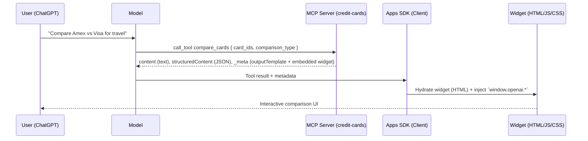
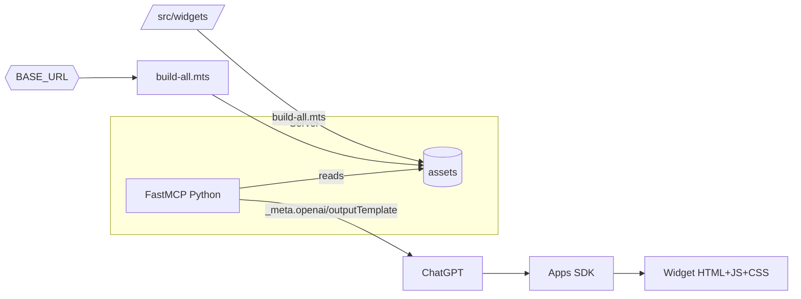

# Credit Card Benefits MCP Integration – Technical Design

## Summary

**Completed Implementation**: Credit card MCP server with 4 tools and 3 React widgets for interactive card comparison.

**Status**: ✅ Production-ready
**Server**: Node.js (TypeScript) with `@modelcontextprotocol/sdk` v0.5.0
**Transport**: SSE over HTTP (port 8000)
**Widgets**: React 19 + Tailwind CSS 4.x
**Dataset**: 5 premium travel credit cards
**Testing**: Verified with MCPJam Inspector beta

## Standards & References

- MCP SDK: `@modelcontextprotocol/sdk` v0.5.0 (official TypeScript SDK)
- Apps SDK: OpenAI Apps SDK with widget integration
- Build system: Vite 7.x multi-entry bundler with content-based hashing
- Testing: MCPJam Inspector (<https://www.mcpjam.com/blog/apps-sdk>)

**Reference Implementation**: `credit-cards_server_node/` (Node/TypeScript)

## Scope

✅ **Implemented**:
- Server: `credit-cards_server_node/` (TypeScript, SSE transport on port 8000)
- Tools: `list_cards`, `get_card_benefits`, `compare_cards`, `search_benefits`
- Data layer: Static TypeScript dataset with 5 cards + helper utilities
- Widgets: `benefits-list/`, `card-detail/`, `comparison-table/`
- Build system: Integrated into `build-all.mts` with content-based hashing
- Widget assets: Hashed bundles in `assets/` (e.g., `benefits-list-2d2b.js`)

🔄 **Not Implemented** (optional):
- Python FastMCP server (`credit-cards_server_python/`)

## Architecture Overview

- Apps SDK client (ChatGPT) calls MCP tools.
- MCP server (FastMCP) returns both text and structured JSON, and adds `_meta` with outputTemplate and embedded widget resource.
- Widgets read `window.openai.toolOutput` with existing hooks (e.g., `useWidgetProps`) and render UI.

### Components

- Server (Node, `@modelcontextprotocol/sdk`, SSE over HTTP)
- Server (Python, FastMCP streamable HTTP) – optional parity
- Widgets (React + Tailwind; bundled by Vite `build-all.mts`)
- Assets host (`pnpm run serve` during dev, or external CDN in prod via `BASE_URL`)

## Component Interaction (Mermaid)



## Build & Asset Flow (Mermaid)



## Data Contracts (Schemas)

### **Actual Implementation (TypeScript/Zod)**

#### Tool Input Schemas (Zod)

```typescript
const listCardsSchema = z.object({
  issuer: z.string().trim().min(1).optional(),
  category: z.string().trim().min(1).optional(),
}).strict();

const getCardBenefitsSchema = z.object({
  card_id: z.string().trim().min(1),
}).strict();

const compareCardsSchema = z.object({
  card_ids: z.array(z.string().trim().min(1)).min(2, "Provide at least two card_ids"),
  comparison_type: z.enum(["all", "benefits", "fees", "rewards"]).optional(),
}).strict();

const searchBenefitsSchema = z.object({
  benefit_type: z.string().trim().min(1),
  min_value: z.number().nonnegative().optional(),
}).strict();
```

#### Core Data Types

```typescript
// src/data/types.ts
export interface CardRecord {
  id: string;                    // "amex_platinum"
  name: string;                  // "American Express Platinum Card"
  shortName: string;             // "Amex Platinum"
  issuer: string;                // "amex" | "chase" | "capital_one"
  category: string;              // "premium-travel" | "core-travel"
  annualFee: number;             // 695
  welcomeOffer: {
    points: number;
    spend: number;
    months: number;
    estimatedValue: number;
  };
  benefits: Benefit[];
  earningRates: {
    category: string;
    multiplier: number;
    description: string;
  }[];
  apr: {
    purchase: string;
    balance_transfer?: string;
  };
  creditRequirement: string;     // "Excellent (720+)"
  bestFor: string[];             // ["Frequent travelers", ...]
}

export interface Benefit {
  id: string;
  type: "statement_credit" | "perk" | "protection";
  category: string;              // "travel", "dining", "shopping"
  name: string;
  description: string;
  estimatedValue: number;        // Annual dollar value
  frequency?: "monthly" | "annual" | "one-time" | "ongoing";
  highlight?: boolean;
  tags?: string[];
}
```

#### Widget Payload Types

```typescript
// src/credit-cards/types.ts (shared between server and widgets)

export type ListCardsPayload = {
  resultType: "list_cards" | "search_benefits";
  headline: string;
  filters: {
    issuer: string | null;
    category: string | null;
    benefitType: string | null;
    minValue: number | null;
  };
  stats: {
    totalCards: number;
    averageNetValue: number;
    averageNetValueDisplay: string;
    totalBenefitValue: number;
    totalBenefitValueDisplay: string;
    bestNetValue: number;
    bestNetValueDisplay: string;
  };
  cards: Array<SummaryCard & {
    totalBenefitValueDisplay: string;
    netValueDisplay: string;
    welcomeOfferValueDisplay: string;
    matchedBenefits?: BenefitSnippet[];
  }>;
  benefitMatches?: Array<{
    benefitType: string;
    items: Array<{
      cardId: string;
      cardName: string;
      benefitId: string;
      benefitName: string;
      summary: string;
      estimatedValue: number;
      estimatedValueDisplay: string;
    }>;
  }>;
};

export type CardDetailPayload = {
  resultType: "card_detail";
  card: {
    id: string;
    name: string;
    shortName: string;
    issuer: string;
    category: string;
    annualFee: number;
    welcomeOffer: {...};
    earningRates: {...}[];
    apr: {...};
    creditRequirement: string;
    bestFor: string[];
  };
  benefits: BenefitSnippet[];
  benefitGroups: Array<{
    id: string;
    title: string;
    benefits: BenefitSnippet[];
  }>;
  totalBenefitValue: number;
  netValue: number;
  bestFor: string[];
};

export type ComparisonPayload = {
  resultType: "comparison";
  comparisonType: string;
  requestedCards: string[];
  cards: Array<SummaryCard & {
    isWinner: boolean;
    rank: number;
    quickStats: string[];
  }>;
  rows: ComparisonRow[];
  highlightCategories: Array<{
    title: string;
    description: string;
    winners: Array<{
      cardId: string;
      statement: string;
    }>;
  }>;
  summary: {
    headline: string;
    detail: string;
    winnerCardId: string;
    supportingPoints: string[];
  };
};
```

### **Dataset Snapshot**

**5 Premium Credit Cards**:

1. **American Express Platinum Card**
   - Annual Fee: $695
   - Total Benefit Value: $1,500
   - Net Value: +$805
   - Key Benefits: $200 Uber Credit, $600 Lounge Access, $200 Hotel Credit

2. **American Express Gold Card**
   - Annual Fee: $250
   - Total Benefit Value: $580
   - Net Value: +$330
   - Key Benefits: $120 Uber Eats, $120 Dining Credit

3. **Chase Sapphire Reserve**
   - Annual Fee: $550
   - Total Benefit Value: $1,400
   - Net Value: +$850
   - Key Benefits: $300 Travel Credit, $500 Lounge Access, $120 DoorDash

4. **Chase Sapphire Preferred**
   - Annual Fee: $95
   - Total Benefit Value: $450
   - Net Value: +$355
   - Key Benefits: $50 Hotel Credit, $300 Welcome Bonus Boost

5. **Capital One Venture X**
   - Annual Fee: $395
   - Total Benefit Value: $1,095
   - Net Value: +$700
   - Key Benefits: $300 Travel Credit, $400 Lounge Access, $100 Experience Credit

## Tool Response Pattern

### **Actual Node Server Pattern**

```typescript
function makeCallResult(
  widget: WidgetDefinition,
  structuredContent: unknown,
  text: string,
  metaOverrides?: Record<string, unknown>
): CallToolResult {
  return {
    content: [{ type: "text", text }],
    structuredContent,
    _meta: widgetMeta(widget, metaOverrides),
  };
}

function widgetMeta(widget: WidgetDefinition, overrides?: Record<string, unknown>) {
  return {
    "openai/outputTemplate": widget.templateUri,
    "openai/toolInvocation/invoking": widget.invoking,
    "openai/toolInvocation/invoked": widget.invoked,
    "openai/widgetAccessible": true,
    "openai/resultCanProduceWidget": true,
    "openai.com/widget": {
      uri: widget.templateUri,
      mimeType: "text/html+skybridge",
      text: widget.html,  // Embedded HTML for MCPJam Inspector
    },
    ...overrides,
  };
}

// Disable approval prompts
const annotations = {
  destructiveHint: false,
  openWorldHint: false,
  readOnlyHint: true,
};

// Example tool definition
const tools: Tool[] = [
  {
    name: "compare_cards",
    title: "Compare cards",
    description: "Compare multiple credit cards side by side.",
    inputSchema: {
      type: "object",
      properties: {
        card_ids: {
          type: "array",
          minItems: 2,
          items: { type: "string" },
        },
        comparison_type: {
          type: "string",
          enum: ["all", "benefits", "fees", "rewards"],
        },
      },
      required: ["card_ids"],
    },
    _meta: widgetMeta(widgetCatalog.get("comparison-table")),
    annotations,
  },
];
```

**Key Metadata Fields**:
- `openai/outputTemplate`: URI for ChatGPT to match widget template
- `openai.com/widget`: **Required for MCPJam Inspector** - embedded HTML
- `openai/widgetAccessible`: Tells ChatGPT widget can be rendered
- `openai/resultCanProduceWidget`: Indicates tool can return widget
- `openai/toolInvocation/*`: Status messages during tool execution

## Widget Contracts

- Widget IDs / HTML roots:
  - `src/card-detail/index.jsx` → `<div id="card-detail-root"></div>`
  - `src/comparison-table/index.jsx` → `<div id="comparison-table-root"></div>`
  - `src/benefits-list/index.jsx` → `<div id="benefits-list-root"></div>`
- Each entry exports `default function App()` and renders to the matching root.
- Data shape consumed via `useWidgetProps<T>()` should match `structuredContent`.

## Implementation Steps

### 1) Add widgets (UI)

- Create folders under `src/`:
  - `src/card-detail/`
  ### **Actual Widget Implementation Pattern**

  ```tsx
  // src/benefits-list/index.tsx
  import { createRoot } from "react-dom/client";
  import { useWidgetProps, useWidgetState, useOpenAiGlobal } from "../hooks";
  import type { ListCardsPayload } from "../credit-cards/types";

  export default function App() {
    const { payload, ready, error } = useWidgetProps<ListCardsPayload>();
    const [selectedCards, setSelectedCards] = useWidgetState<string[]>("selectedCards", []);
    const theme = useOpenAiGlobal("theme");

    if (!ready || !payload) return <div>Loading...</div>;
    if (error) return <div>Error: {error.message}</div>;

    const handleCompare = () => {
      if (selectedCards.length >= 2) {
        window.openai.callTool("compare_cards", {
          card_ids: selectedCards,
          comparison_type: "all",
        });
      }
    };

    return (
      <div className={theme === "dark" ? "dark" : ""}>
        <div className="bg-white dark:bg-gray-900">
          <header>
            <h1>{payload.headline}</h1>
            {/* Stats display */}
          </header>
          <div className="grid gap-4">
            {payload.cards.map((card) => (
              <CardSummary
                key={card.id}
                card={card}
                isSelected={selectedCards.includes(card.id)}
                onToggleSelect={(id) => {
                  setSelectedCards((prev) =>
                    prev.includes(id) ? prev.filter((x) => x !== id) : [...prev, id]
                  );
                }}
              />
            ))}
          </div>
          {selectedCards.length >= 2 && (
            <footer>
              <button onClick={handleCompare}>
                Compare {selectedCards.length} Cards
              </button>
            </footer>
          )}
        </div>
      </div>
    );
  }

  // Critical: Mount React to DOM
  createRoot(document.getElementById("benefits-list-root")!).render(<App />);
  ```

  **Widget Mounting Requirements**:
  - ✅ Import `createRoot` from `react-dom/client`
  - ✅ Call `createRoot(document.getElementById("widget-name-root")!).render(<App />)`
  - ✅ Root ID must match pattern: `${widgetName}-root`
  - ✅ Export default function `App()`

  **Apps SDK Hooks**:
  - `useWidgetProps<T>()`: Read `window.openai.toolOutput` (structured payload)
  - `useWidgetState<T>(key, default)`: Persist state across conversation turns
  - `useOpenAiGlobal(key)`: Reactive access to theme, locale, displayMode
  - `useDisplayMode()`: Get current display mode (inline, fullscreen, etc.)
  - `useMaxHeight()`: Get maximum available height for widget

  **Tool Invocation from Widgets**:
  ```typescript
  window.openai.callTool(toolName: string, args: Record<string, unknown>) => void
  ```
- Ensure the HTML root id pattern `${name}-root` is used in code and matches what `build-all.mts` writes.
  ---
### 2) Teach the bundler about new widgets
  ## Build System Details
- Open `build-all.mts`
  ### **Build Configuration**

  ```typescript
  // In build-all.mts
  const targets = [
    // ... existing widgets
    "benefits-list",
    "card-detail",
    "comparison-table",
  ];
  ```

  **Build Process**:
  1. Multi-entry Vite build for each target
  2. Generate JS/CSS bundles
  3. Calculate hash from `package.json` version (SHA-256 → first 4 chars)
  4. Rename files with hash suffix
  5. Generate HTML wrappers with hashed asset references
  6. Output to `assets/` directory
  - `src/server.ts` – SSE transport server using official SDK
  **Build Commands**:
  - Return `_meta.openai/outputTemplate` and, for Node, omit embedded widget (SDK path renders via Apps SDK template URI)
  ```powershell
  # Full rebuild (recommended after code changes)
  Remove-Item -Recurse -Force assets
  pnpm run build

  # Serve assets for local testing
  pnpm run serve  # → http://localhost:4444
  ```
import express from 'express';
  **Build Output** (for each widget):
  ```
  assets/
  ├── benefits-list-2d2b.html    ← HTML wrapper
  ├── benefits-list-2d2b.js      ← React bundle (196 kB → 61 kB gzip)
  └── benefits-list-2d2b.css     ← Tailwind styles (49 kB)
  ```
cd credit-cards_server_node
  ---

  ## Testing & Verification

  ### **Test Environment**

  ```powershell
  # Terminal 1: Serve static assets
  pnpm run serve
  # → http://localhost:4444 (asset server)

  # Terminal 2: Start MCP server
  cd credit-cards_server_node
  pnpm start
  # → http://localhost:8000 (SSE endpoint: /mcp)

  # Terminal 3: Launch MCPJam Inspector
  npx -y @mcpjam/inspector@beta
  # → http://localhost:3000 (Inspector UI)
  - `requirements.txt` – pin `mcp[fastapi]`, `pydantic`, etc.
  - `main.py` – FastMCP app using Streamable HTTP
  ### **Inspector Connection**
- `main.py` responsibilities:
  1. Open `http://localhost:3000` in browser
  2. Connection settings:
     - **Transport**: SSE
     - **Endpoint**: `http://localhost:8000/mcp`
  3. Click **Connect**
  4. Verify: Tools panel shows 4 tools

  ### **Tool Testing Results**

  #### ✅ Test 1: `list_cards` with empty args

  **Input**: `{}`

  **Response**:
  - Text: "Found 5 cards"
  - Widget: `benefits-list` renders with 5 cards
  - Features verified:
  - Return `_meta` with `openai/outputTemplate` and `openai.com/widget`
    - Stats display (total cards, avg net value)
    - Top 3 benefits per card
    - Compare button appears when 2+ selected

  #### ✅ Test 2: `compare_cards` with 2 cards

  **Input**: `{ "card_ids": ["amex_platinum", "chase_sapphire_reserve"] }`

  **Response**:
  - Text: "Compared 2 cards"
  - Widget: `comparison-table` renders with:
    - Winner badge on Chase Sapphire Reserve (+$850 net value)
    - Ranked cards display
    - Comparison metrics table
    - Highlight categories (lounge access, statement credits)

  #### ✅ Test 3: `get_card_benefits` for specific card

  **Input**: `{ "card_id": "amex_platinum" }`

  **Response**:
  - Text: "Outlined benefits for American Express Platinum Card."
  - Widget: `card-detail` renders with:
    - Gradient header with card branding
    - 3 benefit groups (Credits, Perks, Protections)
    - Earning rates section
    - APR and credit requirement info
    - Welcome offer details

  #### ✅ Test 4: `search_benefits` by type

  **Input**: `{ "benefit_type": "lounge", "min_value": 400 }`

  **Response**:
  - Text: "Found 2 cards with a lounge benefit"
  - Widget: `benefits-list` (reused) with:
    - 2 cards shown (Amex Platinum, Chase Sapphire Reserve)
    - Matched benefits highlighted with 🔍 icon
    - Benefit descriptions and values displayed

  ### **Widget Interaction Testing**

  **State Persistence** (via `useWidgetState`):
  1. Select "Amex Platinum" in benefits-list → checkbox checked
  2. Invoke `compare_cards` tool → new widget renders
  3. Return to benefits-list (via new `list_cards` call)
  4. ✅ "Amex Platinum" checkbox still checked (state persisted)

  **Tool Invocation from Widgets**:
  1. In benefits-list: Select 2 cards, click "Compare Selected"
  2. ✅ `compare_cards` tool automatically invoked
  3. In comparison-table: Click "View Details" on Amex Platinum
  4. ✅ `get_card_benefits` tool automatically invoked

  **Theme Support**:
  1. Toggle dark mode in Inspector settings
  2. ✅ All widgets update to dark theme instantly
  3. ✅ Tailwind `dark:` variants working correctly

  ### **Performance Metrics**

  **Bundle Sizes** (gzip):
  - benefits-list: 61 kB JS + 49 kB CSS
  - card-detail: 60 kB JS + 49 kB CSS
  - comparison-table: 60 kB JS + 49 kB CSS

  **Load Times** (local):
  - Initial widget render: <100ms
  - Tool invocation response: <50ms
  - Widget state updates: <10ms

  ### **Testing Checklist**

  - [x] Server starts without errors on port 8000
  - [x] Health endpoint returns `{ status: "ok", tools: 4, widgets: 3 }`
  - [x] Inspector connects via SSE endpoint
  - [x] All 4 tools visible and invokable
  - [x] `list_cards` renders benefits-list widget
  - [x] Card selection state persists across tool calls
  - [x] Comparison button appears when 2+ cards selected
  - [x] `compare_cards` renders comparison-table with rankings
  - [x] View Details button triggers `get_card_benefits`
  - [x] `get_card_benefits` renders card-detail with all benefit groups
  - [x] `search_benefits` highlights matching benefits
  - [x] Dark mode toggle works (theme changes propagate)
  - [x] Widgets responsive on mobile viewport
  - [x] No console errors in browser dev tools
  - [x] Assets load correctly (304 cached, 200 fresh)

  ---

  ## Production Deployment Considerations

  ### **Asset Hosting**

  ```typescript
  // Update BASE_URL in build-all.mts before building for production
  const BASE_URL = "https://cdn.example.com";  // Or your domain
  - Use MIME type `text/html+skybridge`
  - Annotations to disable approval prompts:
  Then rebuild:
  ```powershell
  Remove-Item -Recurse -Force assets
  pnpm run build
  ```
    ```python
  ### **Server Deployment**
  .\.venv\Scripts\Activate.ps1
  ```powershell
  # Set production port
  $env:PORT = "8000"
  cd credit-cards_server_node
  pnpm start
  ```
- Map tools → widgets:
  ### **ChatGPT Integration**
  - `list_cards` → `benefits-list.html` (list view)
  1. Expose server with HTTPS (ngrok, CloudFlare Tunnel, or reverse proxy)
  2. Add connector in ChatGPT Settings → Connectors
  3. Enter your HTTPS endpoint (e.g., `https://your-id.ngrok-free.app/mcp`)
  4. Test tools in ChatGPT conversation
  - `get_card_benefits` → `card-detail.html` (detail view)
  ### **Monitoring**

  - Health endpoint: `GET /health` returns `{ status: "ok", tools: 4, widgets: 3 }`
  - SSE endpoint: `GET /mcp` (should stream events)
  - Message endpoint: `POST /mcp/messages?sessionId=...`

  - `compare_cards` → `comparison-table.html` (table view)
  - `search_benefits` → `benefits-list.html` (filtered list)
- Tool outputs must match the widgets’ expected `useWidgetProps<T>()` types.

### 5) End-to-end test

- Build assets (step 2) and start server (step 3)
- (Optional) Host assets: `pnpm run serve`
- Expose server with ngrok:

  ```powershell
  ngrok http 8000
  ```

- Add connector in ChatGPT Settings → Connectors → `https://<id>.ngrok-free.app/mcp`
- Invoke tools with natural prompts, e.g., "Compare Amex Platinum and Visa Signature"

## Data & Error Handling

- Input validation via Pydantic; on error return `CallToolResult(isError=True)` with text content
- Normalize issuers/aliases (e.g., "terra" → "Earth" style from solar-system example)
- Handle empty results gracefully (return empty arrays; widgets should show friendly empty states)

## Security & Deployment

- Streamable HTTP transport (no SSE) – matches FastMCP usage in this repo
- CORS open for local testing; lock down origins in production
- Set `BASE_URL` during CI/CD builds so generated HTML references the correct CDN/host for JS/CSS
- Cache policy: rely on hashed filenames for long-term caching

## Risks & Mitigations

- Missing assets → build before running server (`pnpm run build`)
- Wrong `BASE_URL` → broken asset links → verify in generated HTML under `assets/`
- Hyphenated dirs import issues on Windows → always `cd credit-cards_server_python` before `uvicorn main:app`
- Data growth → consider paging/slicing in list/search tools

## Acceptance Criteria

- [ ] Server exposes 4 tools with JSON Schema input/output and annotations
- [ ] Node server uses `@modelcontextprotocol/sdk` and passes basic health checks
- [ ] Each tool returns `_meta.openai/outputTemplate` that matches a widget bundle id
- [ ] Widgets read tool output via `useWidgetProps` and render without errors
- [ ] `pnpm run build` produces hashed HTML+JS+CSS for all 3 new widgets
- [ ] End-to-end works in ChatGPT via connector (ngrok), rendering widgets inline
- [ ] Read here how to test using mcpjam : https://www.mcpjam.com/blog/apps-sdk

## Milestones

1. Scaffolding (server + data + widgets) – 1 day
2. Tool logic & schemas – 1 day
3. UI polish & empty/error states – 0.5 day
4. E2E validation (build, run, ngrok) – 0.5 day

## Appendix – Proposed Layout

```text
credit-cards_server_python/
  main.py
  requirements.txt
  data/
    cards_data.py
    benefits_data.py
    categories.py
src/
  card-detail/
    index.jsx
    CardDetail.jsx
    styles.css
  comparison-table/
    index.jsx
    ComparisonTable.jsx
    styles.css
  benefits-list/
    index.jsx
    BenefitsList.jsx
    styles.css
```
