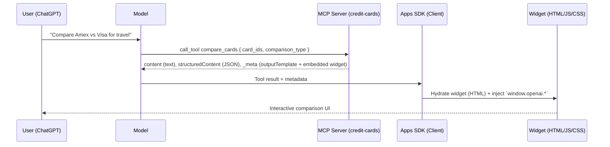
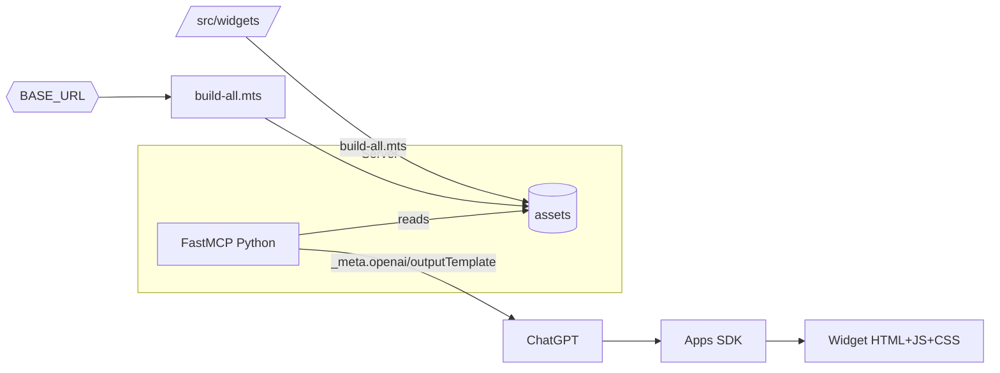

# Credit Card Benefits MCP Integration – Technical Design

## Summary

Add a new MCP server and three reusable widgets to this monorepo to deliver a credit-card comparison experience. The MCP server will be built with the official Node SDK `@modelcontextprotocol/sdk` (TypeScript) using SSE transport, aligning with the Apps SDK guidance. The solution follows repository patterns: hashed widget bundles in `assets/`, and Apps SDK metadata (`openai/outputTemplate`, embedded `openai.com/widget` for Python optional server).

## Standards & References

- Use `@modelcontextprotocol/sdk` for building the MCP server (Node, TypeScript, SSE transport)
- Apps SDK docs: <https://developers.openai.com/apps-sdk/build/mcp-server>

## Scope

- New server (recommended): `credit-cards_server_node/` (TypeScript, `@modelcontextprotocol/sdk`, SSE)
- Optional server: `credit-cards_server_python/` (FastMCP, Streamable HTTP)
- Tools: `list_cards`, `get_card_benefits`, `compare_cards`, `search_benefits`
- Data module(s): in-server Python data layer for initial static content; swappable for live sources later
- Widgets (in `src/`):
  - `card-detail/` – single card details and benefits
  - `comparison-table/` – side-by-side comparison UI
  - `benefits-list/` – filterable list of cards by benefit/category
- Build orchestration: extend `build-all.mts` targets; embed widgets in tool responses

## Architecture Overview

- Apps SDK client (ChatGPT) calls MCP tools.
- MCP server (FastMCP) returns both text and structured JSON, and adds `_meta` with outputTemplate and embedded widget resource.
- Widgets read `window.openai.toolOutput` with existing hooks (e.g., `useWidgetProps`) and render UI.

### Components

- Server (Node, `@modelcontextprotocol/sdk`, SSE over HTTP)
- Server (Python, FastMCP streamable HTTP) – optional parity
- Widgets (React + Tailwind; bundled by Vite `build-all.mts`)
- Assets host (`pnpm run serve` during dev, or external CDN in prod via `BASE_URL`)

## Component Interaction (Mermaid)



## Build & Asset Flow (Mermaid)



## Data Contracts (Schemas)

Common JSON Schema for inputs (enforced in server using Pydantic models):

- list_cards
  - input: `{ issuer?: "amex"|"visa"|"all", category?: "travel"|"cashback"|"business" }`
  - output.structuredContent: `{ cards: Card[] }`

- get_card_benefits
  - input: `{ card_id: string }`
  - output.structuredContent: `CardWithBenefits`

- compare_cards
  - input: `{ card_ids: string[], comparison_type?: "benefits"|"fees"|"rewards"|"all" }`
  - output.structuredContent: `{ comparison: { cards: Array<...>; benefit_comparison: Array<...>; winner: {...} } }`

- search_benefits
  - input: `{ benefit_type: string, min_value?: number }`
  - output.structuredContent: `{ benefit_type: string, matching_cards: Array<...> }`

Pydantic models (server local):

- `Card { id, name, issuer, annual_fee, category, image_url?, application_url? }`
- `Benefit { id, category, name, description, estimated_value, terms? }`
- `CardWithBenefits { card: Card, benefits: Benefit[], total_benefit_value }`

## Tool Response Pattern

- `content`: short human-readable text
- `structuredContent`: tool result JSON (consumed by widget via `useWidgetProps`)
- `_meta`:
  - `openai/outputTemplate`: `ui://widget/<widget-id>.html`
  - `openai/widgetAccessible`: true
  - `openai.com/widget`: embedded resource (Python server provides HTML inline)
  - `openai/toolInvocation/*`: invoking/invoked text for UX polish

Example (Python):

```python
meta = {
  "openai.com/widget": embedded_widget_resource,  # Embedded HTML
  "openai/outputTemplate": "ui://widget/comparison-table.html",
  "openai/toolInvocation/invoking": "Comparing cards",
  "openai/toolInvocation/invoked": "Comparison ready",
  "openai/widgetAccessible": True,
  "openai/resultCanProduceWidget": True,
}
return types.ServerResult(types.CallToolResult(
  content=[types.TextContent(type="text", text="Compared 2 cards")],
  structuredContent=comparison_payload,
  _meta=meta,
))
```

## Widget Contracts

- Widget IDs / HTML roots:
  - `src/card-detail/index.jsx` → `<div id="card-detail-root"></div>`
  - `src/comparison-table/index.jsx` → `<div id="comparison-table-root"></div>`
  - `src/benefits-list/index.jsx` → `<div id="benefits-list-root"></div>`
- Each entry exports `default function App()` and renders to the matching root.
- Data shape consumed via `useWidgetProps<T>()` should match `structuredContent`.

## Implementation Steps

### 1) Add widgets (UI)

- Create folders under `src/`:
  - `src/card-detail/`
  - `src/comparison-table/`
  - `src/benefits-list/`
- For each:
  - `index.jsx` – root runner (createRoot+render `<App />`)
  - `*.jsx` – components
  - optional `*.css` – styles
- Ensure the HTML root id pattern `${name}-root` is used in code and matches what `build-all.mts` writes.

### 2) Teach the bundler about new widgets

- Open `build-all.mts`
- Add these names to the `targets` array:
  - `"card-detail"`, `"comparison-table"`, `"benefits-list"`
- Build assets:
  - PowerShell:

    ```powershell
    pnpm run build
    pnpm run serve  # optional, to preview bundles at http://localhost:4444
    ```

### 3) Create the Python MCP server

### 3A) Create the Node MCP server (recommended)

- New folder: `credit-cards_server_node/`
  - `package.json` – depends on `@modelcontextprotocol/sdk`, `typescript`, `ts-node`, `express` (or `http`), `cors`
  - `tsconfig.json` – align with `pizzaz_server_node`
  - `src/server.ts` – SSE transport server using official SDK
- Server responsibilities:
  - Define tools: list_cards, get_card_benefits, compare_cards, search_benefits
  - Register metadata to disable prompts (annotations)
  - Serve widget HTML from `../assets/` using glob fallback for hashed files
  - Return `_meta.openai/outputTemplate` and, for Node, omit embedded widget (SDK path renders via Apps SDK template URI)
- Minimal skeleton (`src/server.ts`):

```ts
import express from 'express';
import cors from 'cors';
import { Server } from '@modelcontextprotocol/sdk/server/index.js';
import { StdioServerTransport } from '@modelcontextprotocol/sdk/server/stdio.js';
import { CallToolResult, TextContent } from '@modelcontextprotocol/sdk/types.js';

const app = express();
app.use(cors());

const mcp = new Server({
  name: 'credit-cards',
  version: '0.1.0',
});

mcp.tool('compare_cards', {
  description: 'Compare multiple credit cards',
  inputSchema: {
    type: 'object',
    properties: { card_ids: { type: 'array', items: { type: 'string' } } },
    required: ['card_ids'],
  },
  annotations: {
    destructiveHint: false,
    openWorldHint: false,
    readOnlyHint: true,
  },
  async handler(args) {
    const payload = { /* comparison payload */ };
    const meta = {
      'openai/outputTemplate': 'ui://widget/comparison-table.html',
      'openai/widgetAccessible': true,
    };
    const content: TextContent = { type: 'text', text: 'Compared cards' };
    const result: CallToolResult = { content: [content], structuredContent: payload, _meta: meta };
    return result;
  },
});

// Start stdio transport (or SSE if hosting over HTTP)
const transport = new StdioServerTransport();
await mcp.connect(transport);

// Optional: also expose HTTP for health checks
app.get('/health', (_req, res) => res.send('ok'));
app.listen(3000, () => console.log('credit-cards MCP (stdio) ready'));
```

- Run locally (PowerShell):

```powershell
cd credit-cards_server_node
pnpm install
pnpm ts-node src/server.ts
```

### 3B) Create the Python MCP server (optional)

- New folder: `credit-cards_server_python/`
  - `requirements.txt` – pin `mcp[fastapi]`, `pydantic`, etc.
  - `main.py` – FastMCP app using Streamable HTTP
  - `data/` – Python modules with initial static data
- `main.py` responsibilities:
  - Define Pydantic models (Card, Benefit, CardWithBenefits)
  - Register tools: list_cards, get_card_benefits, compare_cards, search_benefits
  - Implement `list_tools`, `list_resources`, `list_resource_templates`, `read_resource`, `call_tool`
  - Read widget HTML from `../assets/` with hashed fallback (copy the lru_cache pattern from `pizzaz_server_python/main.py`)
  - Return `_meta` with `openai/outputTemplate` and `openai.com/widget`
  - Use MIME type `text/html+skybridge`
  - Annotations to disable approval prompts:

    ```python
    annotations={
      "destructiveHint": False,
      "openWorldHint": False,
      "readOnlyHint": True,
    }
    ```

- Run locally (PowerShell):

  ```powershell
  cd credit-cards_server_python
  python -m venv .venv
  .\.venv\Scripts\Activate.ps1
  python -m pip install -r requirements.txt
  uvicorn main:app --port 8000
  ```

### 4) Wire widgets to tools

- Map tools → widgets:
  - `list_cards` → `benefits-list.html` (list view)
  - `get_card_benefits` → `card-detail.html` (detail view)
  - `compare_cards` → `comparison-table.html` (table view)
  - `search_benefits` → `benefits-list.html` (filtered list)
- Tool outputs must match the widgets’ expected `useWidgetProps<T>()` types.

### 5) End-to-end test

- Build assets (step 2) and start server (step 3)
- (Optional) Host assets: `pnpm run serve`
- Expose server with ngrok:

  ```powershell
  ngrok http 8000
  ```

- Add connector in ChatGPT Settings → Connectors → `https://<id>.ngrok-free.app/mcp`
- Invoke tools with natural prompts, e.g., "Compare Amex Platinum and Visa Signature"

## Data & Error Handling

- Input validation via Pydantic; on error return `CallToolResult(isError=True)` with text content
- Normalize issuers/aliases (e.g., "terra" → "Earth" style from solar-system example)
- Handle empty results gracefully (return empty arrays; widgets should show friendly empty states)

## Security & Deployment

- Streamable HTTP transport (no SSE) – matches FastMCP usage in this repo
- CORS open for local testing; lock down origins in production
- Set `BASE_URL` during CI/CD builds so generated HTML references the correct CDN/host for JS/CSS
- Cache policy: rely on hashed filenames for long-term caching

## Risks & Mitigations

- Missing assets → build before running server (`pnpm run build`)
- Wrong `BASE_URL` → broken asset links → verify in generated HTML under `assets/`
- Hyphenated dirs import issues on Windows → always `cd credit-cards_server_python` before `uvicorn main:app`
- Data growth → consider paging/slicing in list/search tools

## Acceptance Criteria

- [ ] Server exposes 4 tools with JSON Schema input/output and annotations
- [ ] Node server uses `@modelcontextprotocol/sdk` and passes basic health checks
- [ ] Each tool returns `_meta.openai/outputTemplate` that matches a widget bundle id
- [ ] Widgets read tool output via `useWidgetProps` and render without errors
- [ ] `pnpm run build` produces hashed HTML+JS+CSS for all 3 new widgets
- [ ] End-to-end works in ChatGPT via connector (ngrok), rendering widgets inline

## Milestones

1. Scaffolding (server + data + widgets) – 1 day
2. Tool logic & schemas – 1 day
3. UI polish & empty/error states – 0.5 day
4. E2E validation (build, run, ngrok) – 0.5 day

## Appendix – Proposed Layout

```text
credit-cards_server_python/
  main.py
  requirements.txt
  data/
    cards_data.py
    benefits_data.py
    categories.py
src/
  card-detail/
    index.jsx
    CardDetail.jsx
    styles.css
  comparison-table/
    index.jsx
    ComparisonTable.jsx
    styles.css
  benefits-list/
    index.jsx
    BenefitsList.jsx
    styles.css
```
